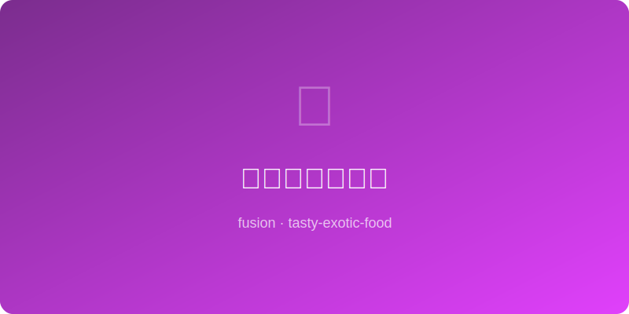

# 泡菜芝士烤饺子 | Kimchi Cheese Baked Gyoza

  

> ⏱ 准备 20分钟 + 烹饪 18分钟 | 💰 ~$5/份(12个) | 🏷️ 融合创意、AI原创、零食、派对

> 日式煎饺的皮配上韩式泡菜和西式芝士的馅——三国联军在烤箱中集结。烤出来的饺子皮酥脆如薯片，咬开后泡菜的酸辣和融化芝士的拉丝一起涌出，蘸上酱油醋汁，这是饺子的全新打开方式。
>
> *Japanese gyoza wrappers housing Korean kimchi and Western cheese filling — a three-nation alliance assembled in the oven. Baked wrappers turn chip-crispy, bite through to find tangy kimchi and molten stretchy cheese bursting out. Dipped in soy-vinegar sauce, this is gyoza reimagined.*

---

## 食材 | Ingredients

| 食材 | Ingredient | 用量 / Amount |
|------|-----------|---------------|
| 饺子皮 (薄型) | Gyoza wrappers (thin) | 24张 / 24 sheets |
| 韩国泡菜 | Korean kimchi | 1杯，挤干切碎 / 1 cup, drained & chopped |
| 马苏里拉芝士碎 | Shredded mozzarella | 100g |
| 奶油芝士 | Cream cheese | 50g |
| 猪肉末 (可选) | Ground pork (optional) | 100g，炒熟 / 100g, cooked |
| 葱花 | Scallion | 2根，切碎 / 2 stalks, chopped |
| 芝麻油 | Sesame oil | 1茶匙 / 1 tsp |
| 橄榄油/喷雾油 | Olive oil / cooking spray | 刷面用 / for brushing |
| **蘸酱** | **Dipping Sauce** | |
| 酱油 | Soy sauce | 2汤匙 / 2 tbsp |
| 米醋 | Rice vinegar | 1汤匙 / 1 tbsp |
| 辣油 | Chili oil | 少许 / a drizzle |

---

## 做法 | Directions

### 1. 调馅 | Make Filling
泡菜挤干切碎，与马苏里拉、奶油芝士、葱花、芝麻油（和熟猪肉末如果用的话）拌匀。

Squeeze kimchi dry and chop. Mix with mozzarella, cream cheese, scallions, sesame oil (and cooked pork if using).

### 2. 包饺子 | Wrap
饺子皮边缘抹水，放一大勺馅在中间，对折捏紧。可以捏褶也可以用叉子压边。

Wet wrapper edges, place a heaped spoonful of filling in center, fold and press to seal. Pleat or crimp with a fork.

### 3. 烤制 | Bake
预热200°C。饺子放在铺了油纸的烤盘上，两面刷橄榄油。烤15-18分钟至金黄酥脆，中途翻面一次。

Preheat 200°C/400°F. Place gyoza on parchment-lined tray, brush both sides with oil. Bake 15-18 min until golden and crispy, flip once halfway.

### 4. 调蘸酱 | Make Sauce & Serve
酱油、米醋和辣油混合。饺子出炉趁热蘸着吃。

Mix soy, vinegar, and chili oil. Serve gyoza hot with dipping sauce.

---

## 要点 | Tips

| 要点 | Tip |
|------|-----|
| 泡菜一定要挤干，否则饺子底会湿软 | Squeeze kimchi bone-dry or bottoms will be soggy |
| 烤比煎更省油且更均匀酥脆 | Baking is lower-fat and more evenly crispy than pan-frying |
| 饺子皮边缘一定要密封好，芝士会从缝隙漏出来 | Seal edges tightly — cheese will ooze from any gaps |
| 可以提前包好冷冻，烤的时候加5分钟 | Wrap ahead and freeze — add 5 min to bake time |
