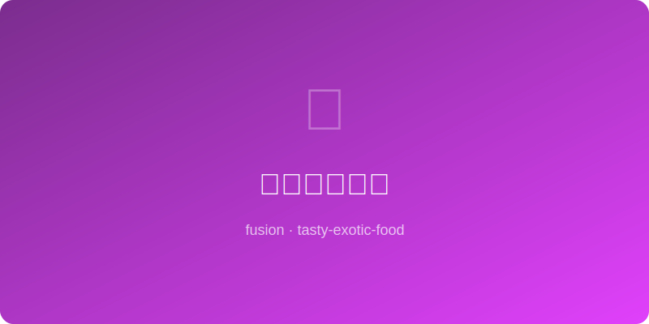

# 泡菜芝士煎饼 | Kimchi Cheese Pancake

  

> ⏱ 准备 5分钟 + 烹饪 10分钟 | 💰 ~$2/份 | 🏷️ 融合创意、煎饼、韩式x西式、🤖 AI Original

> 这是一道AI原创的融合食谱：韩式泡菜煎饼遇上西式芝士。泡菜的酸辣配上融化芝士的浓香咸鲜，外酥里嫩，每一口都是东西方美味的碰撞。做法极其简单，当早餐、下午茶小食或深夜加餐都完美。
>
> *An AI-original fusion recipe: Korean kimchi pancake meets melty Western cheese. The funky tang of kimchi paired with gooey, salty cheese — crispy outside, soft inside, every bite a collision of East and West. Ridiculously easy to make, perfect as breakfast, snack, or midnight fuel.*

---

## 食材 | Ingredients

| 食材 | Ingredient | 用量 / Amount |
|------|-----------|---------------|
| 泡菜（辛奇） | Kimchi, chopped | 1杯 / 1 cup (~150g) |
| 泡菜汁 | Kimchi juice | 2汤匙 / 2 tbsp |
| 中筋面粉 | All-purpose flour | 1/2杯 / 1/2 cup |
| 水 | Water | 1/3杯 / 1/3 cup |
| 鸡蛋 | Egg | 1个 / 1 |
| 马苏里拉芝士（碎） | Shredded mozzarella | 1/2杯 / 1/2 cup |
| 切达芝士（碎） | Shredded cheddar | 1/4杯 / 1/4 cup |
| 葱花 | Scallion, sliced | 2根 / 2 stalks |
| 植物油 | Vegetable oil | 2汤匙 / 2 tbsp |
| 糖 | Sugar | 1/2茶匙 / 1/2 tsp |

### 蘸料 | Dipping Sauce
| 食材 | Ingredient | 用量 / Amount |
|------|-----------|---------------|
| 酱油 | Soy sauce | 1汤匙 / 1 tbsp |
| 米醋 | Rice vinegar | 1茶匙 / 1 tsp |
| 芝麻油 | Sesame oil | 1/2茶匙 / 1/2 tsp |
| 白芝麻 | Sesame seeds | 少许 / a pinch |

---

## 做法 | Directions

### 1. 调面糊 | Make the Batter
碗中混合面粉、水、鸡蛋、泡菜汁和糖，搅拌均匀。加入切碎的泡菜和葱花拌匀。面糊不要太稠，应该是可以流动的。

Mix flour, water, egg, kimchi juice, and sugar in a bowl until smooth. Fold in the chopped kimchi and scallion. The batter should be pourable, not thick — add a splash more water if needed.

### 2. 煎饼（第一面） | Pan-fry Side One
平底锅中火加油，倒入面糊摊平成圆饼（约1厘米厚）。煎3-4分钟至底部金黄酥脆。

Heat oil in a non-stick skillet over medium heat. Pour in the batter and spread into a round pancake (~1cm thick). Cook for 3-4 minutes until the bottom is golden and crispy.

### 3. 翻面加芝士 | Flip & Add Cheese
小心翻面（可以用盘子辅助）。在朝上的那面均匀撒上马苏里拉和切达芝士，盖上锅盖焖2-3分钟，让芝士融化、底部焦脆。

Carefully flip the pancake (slide onto a plate, then invert back into the pan). Sprinkle mozzarella and cheddar over the top, cover with a lid, and cook 2-3 minutes until the cheese melts and the bottom is crispy.

### 4. 切块蘸料 | Slice & Dip
出锅后切成三角块。混合蘸料（酱油+米醋+芝麻油+芝麻），蘸着吃。

Transfer to a cutting board and cut into wedges. Mix the dipping sauce (soy sauce + rice vinegar + sesame oil + sesame seeds) and serve alongside.

---

## 要点 | Tips

| 要点 | Tip |
|------|-----|
| 泡菜选发酵久的（酸的），煎饼更好吃 | Use well-fermented (sour) kimchi for the best flavor |
| 泡菜汁别扔，加进面糊增味增色 | Don't discard kimchi juice — it adds flavor and color to the batter |
| 两种芝士混合最佳：马苏拉丝+切达增味 | Mix of mozz (stretchy) and cheddar (flavor) is the winning combo |
| 中火煎，不要急，急了外焦里生 | Medium heat — don't rush or the outside burns before the inside cooks |
| 翻面时用盘子辅助更安全 | Use a plate to help flip — much safer than air-flipping |

---

## 替代食材 | American Substitutions

| 原料 | Ingredient | 替代 / Substitute | 备注 / Notes |
|------|-----------|-------------------|--------------|
| 泡菜 | Kimchi | Walmart 冷藏区 / Refrigerated section (Mother In Law's, Nasoya) | Trader Joe's 也有 / TJ's carries it too |
| 马苏里拉芝士 | Mozzarella | Walmart/Kroger 乳品区 / Dairy aisle | 碎装袋最方便 / Pre-shredded bags are easiest |
| 切达芝士 | Cheddar | 任何超市 / Any supermarket | Sharp cheddar 味道更浓 / Sharp cheddar has more flavor |
| 米醋 | Rice vinegar | Walmart 亚洲食品区 / Asian aisle | 苹果醋也行 / Apple cider vinegar also works |
| 中筋面粉 | All-purpose flour | 任何超市 / Any supermarket | — |
