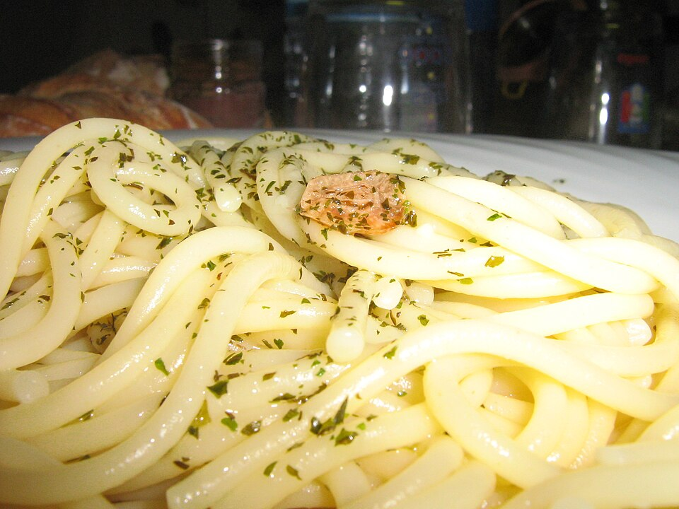

# 老干妈意面 | Lao Gan Ma Pasta

> ⏱ 准备 2分钟 + 烹饪 10分钟 | 💰 ~$2/份 | 🏷️ 融合创意、TikTok爆款、全超市可买、宿舍可做

  

> TikTok 上播放量过亿的神级融合菜——中国辣酱遇上意大利面，碰撞出让人上瘾的味道。老干妈的香辣油脂裹在 al dente 的意面上，再加个煎蛋，这就是留学生在异国他乡发明的终极comfort food。
>
> *The viral TikTok sensation with hundreds of millions of views — Chinese chili crisp meets Italian pasta, creating an addictive fusion. Lao Gan Ma's spicy, crunchy oil coating al dente spaghetti, topped with a fried egg — the ultimate comfort food invented by international students far from home.*

---

## 食材 | Ingredients

| 食材 | Ingredient | 用量 / Amount |
|------|-----------|---------------|
| 意面 | Spaghetti | 1人份 / 1 serving (~100g) |
| 老干妈辣椒酱 | Lao Gan Ma Spicy Chili Crisp | 2-3汤匙 / 2-3 tbsp |
| 蒜 | Garlic | 2瓣 / 2 cloves |
| 酱油 | Soy sauce | 1汤匙 / 1 tbsp |
| 鸡蛋 | Egg (for topping) | 1个 / 1 |
| 葱花 | Chopped scallion | 适量 / for garnish |
| 芝麻 (可选) | Sesame seeds (optional) | 少许 / a pinch |

---

## 做法 | Directions

### 1. 煮面 | Cook Pasta
烧一大锅盐水，煮意面至 al dente（比包装时间少1分钟）。留半杯煮面水，沥干。

Boil salted water, cook spaghetti to al dente (1 min less than package). Save 1/2 cup pasta water, drain.

### 2. 炒酱 | Make the Sauce
锅中不加油（老干妈自带油），放入蒜末炒香10秒。加入老干妈和酱油，翻炒30秒。

No oil needed (Lao Gan Ma has plenty). Sizzle minced garlic 10 seconds. Add Lao Gan Ma and soy sauce, stir 30 seconds.

### 3. 拌面 | Toss
放入沥干的面条，加2-3汤匙煮面水，大火翻拌至酱汁均匀裹住每根面条。

Add drained pasta and 2-3 tbsp pasta water. Toss over high heat until every strand is coated.

### 4. 煎蛋上桌 | Top & Serve
另起锅煎一个荷包蛋（溏心最好）。面条盛出，放上煎蛋，撒葱花和芝麻。

Fry an egg in another pan (runny yolk is best). Plate the pasta, top with the egg, sprinkle scallions and sesame.

---

## 要点 | Tips

| 要点 | Tip |
|------|-----|
| 老干妈要选"风味豆豉"或"辣三丁"，不要选纯辣椒油 | Choose "Spicy Chili Crisp" (风味豆豉) — not plain chili oil |
| 煮面水是灵魂，淀粉水让酱汁乳化 | Pasta water is key — the starch helps the sauce emulsify |
| 煎蛋一定要溏心，戳破蛋黄拌面超级爽 | Runny egg is a must — breaking the yolk into the pasta is pure bliss |
| 可以加任何蔬菜/蛋白质：西兰花、鸡肉、虾仁 | Add any veggies or protein: broccoli, chicken, shrimp |

---

## 替代食材 | American Substitutions

| 原料 | Ingredient | 替代 / Substitute | 备注 / Notes |
|------|-----------|-------------------|--------------|
| 老干妈 | Lao Gan Ma Chili Crisp | 亚洲超市必有；Amazon ~$5 | 替代：Trader Joe's Chili Onion Crunch |
| 意面 | Spaghetti | 任何超市 $1/盒 | Barilla、De Cecco |
| 鸡蛋 | Egg | 任何超市 | — |
