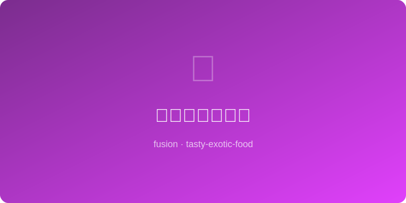

# 老干妈烤三明治 | LGM Grilled Cheese

  

> 🤖 AI Original — 国民辣酱与经典烤芝士三明治的跨界碰撞

---

## 基本信息

- **难度**: ⭐ 超简单
- **时间**: 15 分钟
- **份量**: 2 份
- **类型**: 快餐 / 早午餐

---

## 食材清单

| 食材 | 用量 | 备注 |
|------|------|------|
| 吐司面包 | 4 片 | 厚切白吐司或酸面团 |
| 老干妈油辣椒 | 2 大勺 | 带豆豉颗粒的更佳 |
| 切达芝士片 | 4 片 | 或马苏里拉 |
| 黄油 | 30g | 软化，涂面包外侧 |
| 鸡蛋 | 1 个 | 可选，煎荷包蛋夹入 |
| 小葱 | 1 根 | 切碎撒面 |

---

## 制作步骤

1. **涂酱**: 每片吐司的一面涂上一层老干妈（内侧）。
2. **铺芝士**: 在两片涂了老干妈的吐司上各放 2 片芝士，合上另一片吐司（老干妈面朝内）。
3. **涂黄油**: 三明治外侧两面均匀涂上软化的黄油。
4. **煎制**: 平底锅中小火预热，放入三明治，用锅铲轻轻压平。
5. **翻面**: 煎 3 分钟至底面金黄酥脆，小心翻面。
6. **再煎**: 另一面煎 2-3 分钟，至芝士完全融化、两面金黄。
7. **切盘**: 对角线切开，可以看到拉丝的芝士和红亮的辣酱。

---

## 小贴士

- 全程中小火，大火容易外焦芝士未化。
- 用锅铲压一压能让芝士融化更均匀。
- 加一个煎蛋夹在中间，流心蛋黄配老干妈堪称绝味。
- 可加入火腿片或午餐肉增加满足感。

---

*🤖 AI Original Recipe — 咬下去先是黄油酥壳的咔嚓声，接着是拉丝芝士裹着老干妈豆豉的咸香辣，简单却让人上瘾。*
