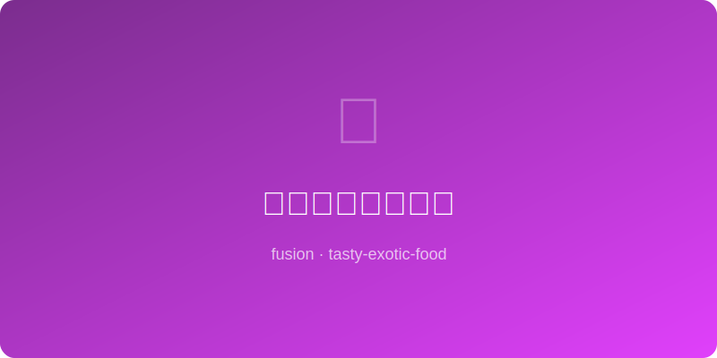

# 老干妈芝士焗蘑菇 | LGM Cheese Stuffed Mushroom

  

> ⏱ 准备 10分钟 + 烹饪 18分钟 | 💰 ~$5/份(6个) | 🏷️ 融合创意、AI原创、开胃菜、派对

> 口蘑去蒂后变成天然小碗，填上老干妈拌奶油芝士的馅料送进烤箱——芝士融化冒泡，老干妈的辣油渗出红色纹路，一口咬下去是辣、咸、奶香和蘑菇鲜味的四重奏。完美的派对开胃菜。
>
> *Button mushrooms become natural little bowls when stemmed, stuffed with a Lao Gan Ma cream cheese filling and baked until bubbly — the cheese melts and the chili oil bleeds gorgeous red streaks. One bite delivers a quartet of spicy, salty, creamy, and earthy umami. The perfect party appetizer.*

---

## 食材 | Ingredients

| 食材 | Ingredient | 用量 / Amount |
|------|-----------|---------------|
| 大口蘑 | Large button/cremini mushrooms | 12个 / 12 |
| 奶油芝士 | Cream cheese (softened) | 120g |
| 老干妈风味豆豉 | Lao Gan Ma Spicy Chili Crisp | 2汤匙 / 2 tbsp |
| 马苏里拉芝士碎 | Shredded mozzarella | 60g |
| 蒜 | Garlic | 2瓣，切末 / 2 cloves, minced |
| 葱花 | Scallion | 2根 / 2 stalks |
| 酱油 | Soy sauce | 1茶匙 / 1 tsp |
| 面包糠 (可选) | Panko breadcrumbs (optional) | 2汤匙 / 2 tbsp |

---

## 做法 | Directions

### 1. 准备蘑菇 | Prep Mushrooms
蘑菇去蒂（蒂切碎备用），用厨房纸擦干净。外部刷一层薄油。

Remove mushroom stems (chop stems finely, reserve). Wipe caps clean with paper towel. Brush outsides with a thin layer of oil.

### 2. 调馅 | Make Filling
奶油芝士加老干妈、蒜末、葱花（留一些装饰用）、酱油和切碎的蘑菇蒂拌匀。

Mix cream cheese with Lao Gan Ma, garlic, scallions (save some for garnish), soy sauce, and chopped mushroom stems.

### 3. 填馅烤制 | Stuff & Bake
每个蘑菇杯填满馅料，顶部撒马苏里拉和面包糠。190°C烤15-18分钟至芝士金黄冒泡。

Fill each mushroom cap with the mixture, top with mozzarella and panko. Bake at 190°C/375°F for 15-18 min until cheese is golden and bubbling.

### 4. 出盘 | Serve
出炉撒葱花，趁热上桌。小心烫嘴！

Sprinkle reserved scallions, serve hot. Careful — molten filling!

---

## 要点 | Tips

| 要点 | Tip |
|------|-----|
| 选大个蘑菇，小的填不了多少馅 | Pick large mushrooms — small ones can't hold enough filling |
| 蘑菇不要洗，用纸擦就好，洗了会出太多水 | Don't wash mushrooms — just wipe. Washing makes them waterlogged |
| 面包糠让顶部更脆，不加也行 | Panko adds crunch on top but is optional |
| 可以提前填好冷藏，客人来了直接烤 | Stuff ahead and refrigerate — bake when guests arrive |
