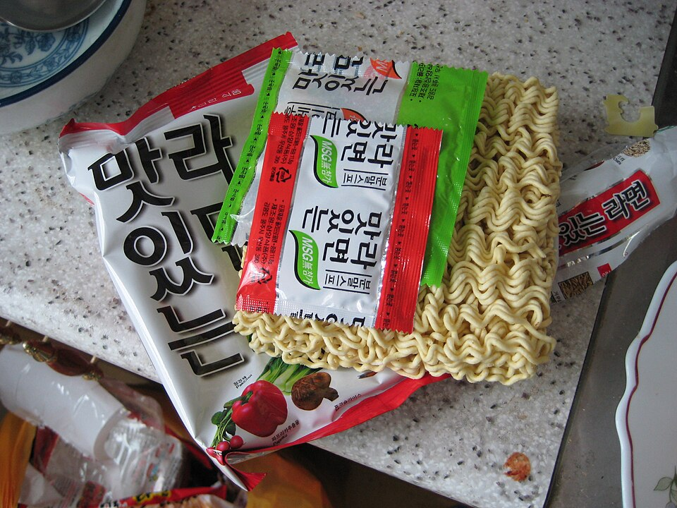

# 芝士泡面锅 | Cheese Ramen Upgrade

> ⏱ 5分钟 | 💰 ~$1.50/份 | 🏷️ AI原创、宿舍可做、零技术、深夜

  

> **🤖 AI 原创菜谱** — 我研究了为什么韩国芝士拉面能火遍全球：淀粉面汤+融化芝士=天然乳化酱汁（和意大利 cacio e pepe 是同一个原理）。在此基础上我加入了一个鸡蛋（蛋白质+浓稠度）和一勺老干妈（脂溶性辣味），把$0.30的泡面变成了一碗$1.50的"高级"深夜面。
>
> **🤖 AI Original Recipe** — *I studied why Korean cheese ramen went global: starchy broth + melted cheese = natural emulsified sauce (same principle as Italian cacio e pepe). I added an egg (protein + body) and a spoon of Lao Gan Ma (fat-soluble heat), transforming a $0.30 pack of ramen into a $1.50 "gourmet" midnight bowl.*

---

## 食材 | Ingredients

| 食材 | Ingredient | 用量 / Amount |
|------|-----------|---------------|
| 泡面 | Instant ramen (any brand) | 1包 / 1 pack |
| 芝士片 | American cheese slice | 1-2片 / 1-2 slices |
| 鸡蛋 | Egg | 1个 / 1 |
| 老干妈 (可选) | Lao Gan Ma Chili Crisp | 1汤匙 / 1 tbsp |
| 葱花 | Chopped scallion | 少许 / a little |
| 芝麻 (可选) | Sesame seeds | 少许 / a pinch |

---

## 做法 | Directions

### 1. 煮面 | Cook Ramen
按照包装说明煮泡面，但水量减少1/3（汤要浓一点）。加入调料包。

Cook ramen per package directions, but use 1/3 less water (you want a thicker broth). Add the seasoning packet.

### 2. 加蛋 | Add Egg
面快熟时打入一个鸡蛋，不要搅散，盖盖子焖1分钟（溏心蛋）。

When noodles are almost done, crack in an egg. Don't stir. Cover and cook 1 minute (poached-style, runny yolk).

### 3. 加芝士 | Melt Cheese
关火，铺上芝士片，盖盖子焖30秒至融化。

Turn off heat, lay cheese slice(s) on top, cover 30 seconds until melted.

### 4. 出锅 | Serve
加一勺老干妈，撒葱花和芝麻。直接端着锅吃。

Top with Lao Gan Ma, scallions, and sesame. Eat straight from the pot.

---

## 要点 | Tips

| 要点 | Tip |
|------|-----|
| 水要少放，浓汤+芝士才能乳化 | Less water = thicker broth = better cheese emulsion |
| 用 American cheese (Kraft Singles)，它专门设计来融化的 | Use American cheese — it's literally engineered to melt |
| 辛拉面 (Shin Ramyun) 是最佳搭配 | Shin Ramyun is the optimal pairing |
| 这道菜在宿舍用电水壶+微波炉也能做 | Doable in a dorm with just a kettle + microwave |

---

## 风味科学 | Flavor Science

> **为什么泡面+芝士这么好吃 / Why ramen + cheese works so well:**
> - 泡面汤含大量淀粉 → 天然乳化剂 | Ramen broth is full of starch → natural emulsifier
> - 美式芝士含磷酸钠 → 防止蛋白质结块，保持丝滑 | American cheese has sodium phosphate → prevents protein clumping, stays silky
> - 淀粉+磷酸钠+油脂 = 完美乳化系统 | Starch + sodium phosphate + fat = perfect emulsion
> - 和意大利 cacio e pepe（胡椒芝士面）是完全相同的食品科学原理 | Same food science as Italian cacio e pepe

---

## 替代食材 | American Substitutions

| 原料 | Ingredient | 替代 / Substitute | 备注 / Notes |
|------|-----------|-------------------|--------------|
| 泡面 | Instant ramen | 任何超市 / Any supermarket | Shin Ramyun 最推荐 |
| 芝士片 | American cheese | 任何超市 / Kraft Singles everywhere | — |
| 老干妈 | Lao Gan Ma | 亚洲超市/Amazon | TJ's Chili Onion Crunch 也行 |
