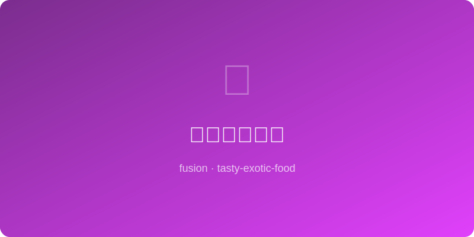

# 花椒可可热饮 | Sichuan Cocoa Hot Chocolate

  

> 🤖 AI Original | ⏱ 准备 2分钟 + 烹饪 5分钟 | 💰 ~$1.5/份 | 🏷️ 融合创意、冬日热饮、一锅出

> 四川花椒的麻与比利时可可的苦甜在牛奶中相遇——舌尖先是巧克力的丝滑，随后花椒的电麻感从喉咙深处升起，像一场味觉烟花。这杯热饮重新定义了"热巧克力"。
>
> *Sichuan peppercorn's tingle meets Belgian cocoa's bittersweet depth in warm milk — first comes chocolate silk, then an electric buzz rises from the throat. This cup redefines hot chocolate.*

---

## 食材 | Ingredients

| 食材 | Ingredient | 用量 / Amount |
|------|-----------|---------------|
| 全脂牛奶 | Whole milk | 1杯 / 1 cup (240ml) |
| 可可粉 | Cocoa powder (unsweetened) | 1.5汤匙 / 1.5 tbsp |
| 花椒 | Sichuan peppercorns | 8-10粒 / 8-10 whole |
| 糖 | Sugar | 1汤匙 / 1 tbsp (adjust) |
| 黑巧克力 | Dark chocolate chips | 15g / ~1 tbsp |
| 淡奶油（可选） | Whipped cream (optional) | 适量 / for topping |

---

## 做法 | Directions

### 1. 煮花椒牛奶 | Infuse the Milk
小锅中放入牛奶和花椒，小火加热至微微冒泡（不要煮沸），关火盖盖焖2分钟，滤出花椒。

Heat milk with peppercorns in a small pot until tiny bubbles form (do not boil). Cover, steep 2 min, then strain out peppercorns.

### 2. 融巧克力 | Melt Cocoa In
将可可粉和糖筛入花椒牛奶，小火搅拌。加入黑巧克力碎，搅至完全融化顺滑。

Sift cocoa and sugar into the infused milk, stir over low heat. Add chocolate chips, stir until fully melted and smooth.

### 3. 倒杯享用 | Pour & Enjoy
倒入马克杯，可挤上淡奶油，撒少许可可粉和碾碎的花椒粉装饰。

Pour into a mug. Top with whipped cream if desired, dust with cocoa and a tiny pinch of ground Sichuan pepper.

---

## 风味科学 | Flavor Science

花椒中的羟基-α-山椒素（hydroxy-alpha-sanshool）激活触觉神经而非味觉神经，产生"麻"的震颤感，与可可中的苦味碱形成跨感官对比。脂肪丰富的全脂牛奶作为载体，缓释两种风味分子，延长口腔中的感受时间。

*Hydroxy-alpha-sanshool in Sichuan pepper activates tactile nerves (not taste buds), creating a tingling buzz that contrasts with cocoa's bitter alkaloids across sensory channels. Full-fat milk acts as a slow-release vehicle, prolonging both sensations on the palate.*

---

## 替代食材 | Substitutions

| 原料 / Original | 替代 / Substitute | 备注 / Notes |
|-----------------|-------------------|--------------|
| 花椒 | 日本山椒 or 粉红胡椒 pink peppercorn | 麻感略弱 / Milder tingle |
| 全脂牛奶 | 燕麦奶 oat milk | 脂肪含量接近，口感好 / Similar creaminess |
| 黑巧克力 | 可可含量 70%+ 巧克力棒掰碎 | Any 70%+ dark chocolate bar, chopped |
