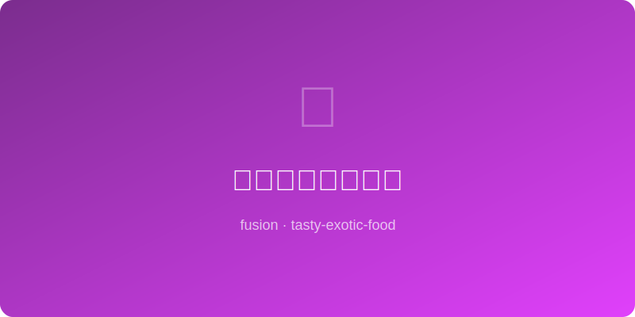

# 花椒巧克力冰淇淋 | Sichuan Chocolate Ice Cream

  

> 🤖 AI Original — 花椒的电流感与浓醇巧克力的终极感官冒险

---

## 基本信息

- **难度**: ⭐⭐⭐ 中等
- **时间**: 30 分钟（+ 冷冻 4-6 小时）
- **份量**: 约 600ml
- **类型**: 甜品 / 冰品

---

## 食材清单

| 食材 | 用量 | 备注 |
|------|------|------|
| 牛奶 | 250ml | 全脂牛奶 |
| 淡奶油 | 200ml | 动物性，脂肪 35%以上 |
| 黑巧克力 | 100g | 可可含量 70% |
| 蛋黄 | 3 个 | 室温 |
| 白砂糖 | 60g | 分两次加 |
| 青花椒 | 1.5 大勺 | 香气更清新 |
| 可可粉 | 1 大勺 | 无糖，增加深度 |
| 香草精 | 1/2 小勺 | 可选 |
| 盐 | 1 小撮 | 提升甜感 |

---

## 制作步骤

1. **花椒浸泡**: 牛奶倒入小锅，加入青花椒，小火加热至微微冒泡，关火加盖焖 20 分钟，过滤去花椒粒。
2. **融巧克力**: 黑巧克力掰碎放入碗中，隔水加热或微波炉分次加热至融化顺滑。
3. **打蛋黄**: 蛋黄加 30g 糖，打蛋器打至颜色变浅、体积膨大。
4. **冲蛋黄**: 将花椒牛奶慢慢倒入蛋黄中，边倒边搅（调温，防止蛋黄结块）。
5. **煮蛋奶糊**: 混合液倒回锅中，小火加热，不停搅拌，至液体能挂住勺背（约 82°C），立刻离火。
6. **加巧克力**: 趁热将蛋奶糊倒入融化的巧克力中，搅拌至完全融合顺滑。筛入可可粉拌匀。
7. **冷却**: 碗底垫冰水快速降温，加入香草精和盐搅匀。
8. **打奶油**: 淡奶油加剩余 30g 糖打至六分发（可流动的浓稠状态），拌入巧克力糊中。
9. **冷冻**: 倒入密封容器，冰箱冷冻。每隔 1 小时取出搅拌一次，共搅拌 3-4 次（有冰淇淋机则直接用机器搅冻）。
10. **食用**: 从冷冻取出后室温放置 5 分钟，挖球装盘。

---

## 小贴士

- 青花椒比红花椒更适合甜品，麻香更清雅。
- 浸泡时间决定麻感强度，20 分钟为微麻，30 分钟则更明显。
- 没有冰淇淋机的话，多次搅拌是防止冰晶的关键。
- 可在表面撒少许现磨花椒粉和海盐片做装饰。
- 搭配一杯浓缩咖啡做 affogato 也非常惊艳。

---

*🤖 AI Original Recipe — 浓醇巧克力在舌尖融化的瞬间，花椒的酥麻如同微小的电火花在口腔中绽放，这是一勺充满冒险精神的冰淇淋。*
