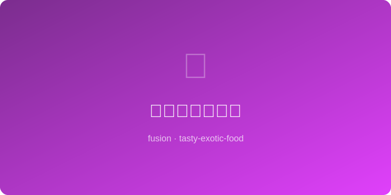

# 花椒盐烤牛油果 | Sichuan Salt Baked Avocado

  

> **AI Original** - Creamy baked avocado topped with a tingling Sichuan peppercorn salt crust

---

## 基本信息 | Basic Info

| 项目 | 详情 |
|------|------|
| 份量 Serves | 2人份 |
| 准备时间 Prep | 5分钟 |
| 烹饪时间 Cook | 15分钟 |
| 难度 Difficulty | ★☆☆☆☆ |

---

## 食材 | Ingredients

- 牛油果 avocado — 2个（成熟但稍硬）
- 花椒粉 Sichuan peppercorn powder — 1/2茶匙
- 海盐 sea salt — 1/2茶匙
- 鸡蛋 egg — 2个（小的）
- 帕尔玛干酪 Parmesan — 20g（刨丝）
- 辣椒片 chili flakes — 少许
- 青柠汁 lime juice — 适量
- 香菜 cilantro — 适量（装饰）

---

## 做法 | Instructions

1. **预热烤箱** — 200°C (400°F)。
2. **处理牛油果** — 对半切开去核，用勺子将果核坑稍微挖大一点以便放入鸡蛋。
3. **调花椒盐** — 花椒粉和海盐混合。
4. **填入鸡蛋** — 牛油果放入小烤盘（用锡纸团固定不倒），每个坑打入一个鸡蛋，撒花椒盐和帕尔玛干酪。
5. **烘烤** — 烤12-15分钟至蛋白凝固、蛋黄仍流动（按喜好调整时间）。
6. **装盘** — 出炉撒辣椒片、挤青柠汁、放香菜叶。

---

## 小贴士 | Tips

- 牛油果选刚好成熟偏硬的，太软烤后会塌。
- 花椒的麻与牛油果的油润形成美妙对比。
- 锡纸团是防止牛油果滚动的好办法。
- 可搭配烤面包片作为周末早午餐。
