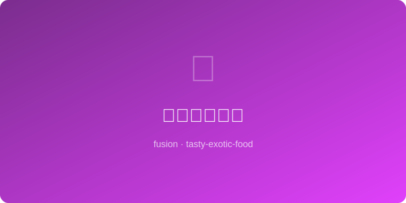

# 花椒芒果冰沙 | Sichuan Mango Smoothie

  

> 🤖 AI Original | ⏱ 准备 5分钟 + 烹饪 0分钟 | 💰 ~$2/份 | 🏷️ 融合创意、夏日冷饮、零烹饪

> 热带芒果的甜蜜果香中暗藏四川花椒的电光麻——每一口先是芒果的热情拥抱，随后花椒在舌尖跳舞。这杯冰沙让你的嘴巴经历一场热带-四川的次元跳跃。
>
> *Tropical mango's sweet perfume hides a Sichuan peppercorn lightning bolt — each sip starts with mango's warm hug, then peppercorn dances on your tongue. This smoothie dimension-hops between the tropics and Sichuan.*

---

## 食材 | Ingredients

| 食材 | Ingredient | 用量 / Amount |
|------|-----------|---------------|
| 冷冻芒果块 | Frozen mango chunks | 1杯 / 1 cup (150g) |
| 酸奶（原味） | Plain yogurt | 1/2杯 / 1/2 cup |
| 花椒粉 | Ground Sichuan pepper | 1/8茶匙 / 1/8 tsp (start small) |
| 蜂蜜 | Honey | 1汤匙 / 1 tbsp |
| 酸橙汁 | Lime juice | 1汤匙 / 1 tbsp |
| 冰块 | Ice cubes | 3-4块 / 3-4 cubes |

---

## 做法 | Directions

### 1. 打冰沙 | Blend
所有食材放入搅拌机，高速打30-45秒至顺滑。尝一下，按需加蜂蜜或花椒粉。

Add all ingredients to a blender. Blend on high 30-45 sec until smooth. Taste, adjust honey or pepper.

### 2. 调试平衡 | Fine-Tune
花椒的麻感需要15-20秒才显现——打完先等一会再决定是否加量。酸橙汁的量可以微调以平衡甜度。

The tingle takes 15-20 sec to kick in — wait before adding more. Adjust lime to balance sweetness.

### 3. 倒杯享用 | Pour & Enjoy
倒入玻璃杯，可在表面撒极少量花椒粉和一片酸橙装饰。用粗吸管或直接喝。

Pour into a glass, dust with a hint of pepper and a lime wedge. Use a wide straw or drink directly.

---

## 风味科学 | Flavor Science

芒果中的萜烯类香气分子（特别是月桂烯）与花椒中的芳樟醇属于同一化学家族，这就是为什么它们闻起来"似乎应该在一起"——大脑将同族分子识别为和谐组合。花椒的麻感激活冷觉受体TRPM8，与冰沙的物理低温产生双重清凉体验。

*Mango's terpene aroma molecules (especially myrcene) and Sichuan pepper's linalool belong to the same chemical family, which is why they "seem like they should go together" — the brain recognizes same-family molecules as harmonious. Sanshool's tingle activates cold-receptor TRPM8, doubling the cooling effect alongside the smoothie's physical chill.*

---

## 替代食材 | Substitutions

| 原料 / Original | 替代 / Substitute | 备注 / Notes |
|-----------------|-------------------|--------------|
| 冷冻芒果 | 冷冻桃子 frozen peach | 同样与花椒搭配出色 / Also pairs well |
| 酸奶 | 椰子酸奶 coconut yogurt | 纯素+椰香加持 / Vegan + coconut note |
| 花椒粉 | 现磨花椒 freshly ground | 香气更鲜活 / More vibrant aroma |
