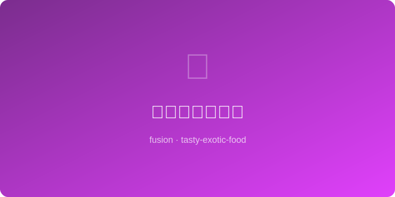

# 花椒蜂蜜烤玉米 | Sichuan Honey Grilled Corn

  

> **AI Original** - Sweet honey glaze electrified by the tingle of Sichuan peppercorn

---

## 基本信息 | Basic Info

| 项目 | 详情 |
|------|------|
| 份量 Serves | 4根 |
| 准备时间 Prep | 5分钟 |
| 烹饪时间 Cook | 20分钟 |
| 难度 Difficulty | ★☆☆☆☆ |

---

## 食材 | Ingredients

- 甜玉米 sweet corn — 4根（去皮）
- 蜂蜜 honey — 3大匙
- 黄油 butter — 30g（融化）
- 花椒粉 Sichuan peppercorn powder — 1茶匙
- 辣椒粉 chili powder — 1/2茶匙
- 海盐 sea salt — 1/2茶匙
- 青葱 scallion — 1根（切碎，装饰）
- 青柠 lime — 1个（切角，配用）

---

## 做法 | Instructions

1. **调蜜酱** — 融化黄油中加入蜂蜜、花椒粉、辣椒粉、海盐搅匀。
2. **预热** — 烤箱220°C (425°F) 或准备烧烤炉中高火。
3. **刷酱** — 玉米表面均匀刷上花椒蜂蜜酱。
4. **烤制** — 放入烤箱或烤架，每5分钟转动并再刷一次酱，共烤15-20分钟至玉米金黄、部分焦斑。
5. **装盘** — 出炉撒葱花，配青柠角，挤汁享用。

---

## 小贴士 | Tips

- 花椒的麻与蜂蜜的甜在高温下会产生令人上瘾的风味。
- 玉米选新鲜甜玉米，糯玉米口感不同但也可用。
- 烧烤炉烤出来有烟熏味更佳，烤箱也完全可以。
- 喜欢芝士可在最后2分钟撒上帕尔玛干酪碎。
