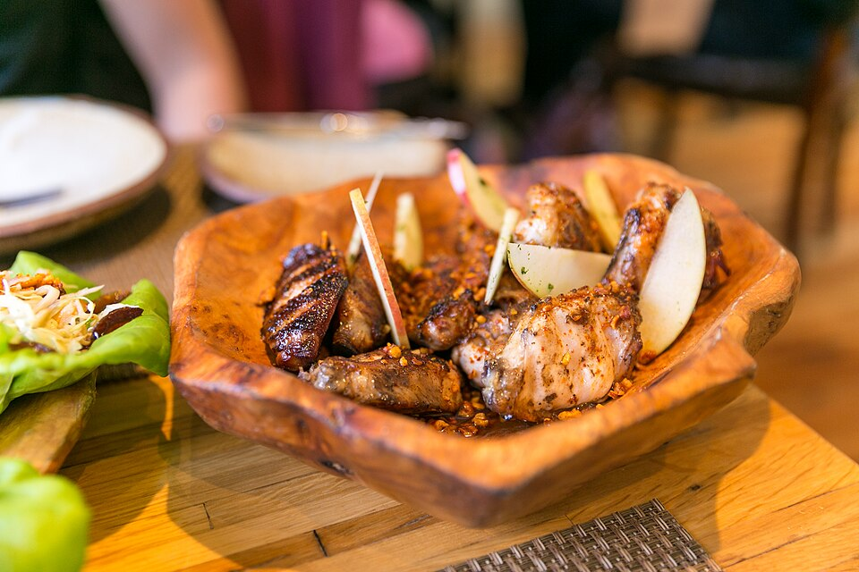

# 花椒蜂蜜烤鸡翅 | Sichuan Honey Glazed Wings

> ⏱ 准备 10分钟 + 腌制 30分钟 + 烹饪 25分钟 | 💰 ~$4/份 | 🏷️ AI原创、烤箱/空气炸锅、派对菜

  

> **🤖 AI 原创菜谱** — 我把四川花椒的麻、蜂蜜的甜、酱油的鲜三条味觉线编织在一起。花椒的麻让味蕾"震动"，使蜂蜜的甜味被感知得更加强烈（这叫"味觉对比增强"）；烤箱高温让蜂蜜焦糖化，形成酥脆的"甜辣铠甲"。这道菜是为留学生派对设计的——一口上瘾，第二口停不下来。
>
> **🤖 AI Original Recipe** — *I wove together three flavor threads: Sichuan peppercorn's numbing tingle, honey's sweetness, and soy sauce's umami. The peppercorn's numbing sensation "vibrates" your taste buds, making the honey taste even sweeter (this is called "taste contrast enhancement"). High oven heat caramelizes the honey into a crispy "sweet-spicy armor." Designed for student parties — one bite hooks you, the second makes you unstoppable.*

---

## 食材 | Ingredients

| 食材 | Ingredient | 用量 / Amount |
|------|-----------|---------------|
| 鸡翅 | Chicken wings | 500g (~10个 / ~10 pieces) |
| 蜂蜜 | Honey | 3汤匙 / 3 tbsp |
| 酱油 | Soy sauce | 2汤匙 / 2 tbsp |
| 花椒粉 | Ground Sichuan peppercorn | 1茶匙 / 1 tsp |
| 蒜泥 | Minced garlic | 1汤匙 / 1 tbsp |
| 辣椒粉 | Chili flakes | 1茶匙 / 1 tsp |
| 米醋 | Rice vinegar | 1汤匙 / 1 tbsp |
| 芝麻 | Sesame seeds | 适量 / for garnish |
| 葱花 | Chopped scallion | 适量 / for garnish |

---

## 做法 | Directions

### 1. 调酱腌制 | Mix & Marinate
碗中混合蜂蜜、酱油、花椒粉、蒜泥、辣椒粉和米醋。鸡翅划两刀，放入酱中腌制至少30分钟（隔夜更好）。

Combine honey, soy sauce, Sichuan pepper, garlic, chili flakes, and rice vinegar. Score the wings with 2 cuts each. Marinate at least 30 minutes (overnight is better).

### 2. 烤制 | Bake
烤箱预热200°C (400°F)。鸡翅铺在烤网上（下面放烤盘接油），烤20分钟。

Preheat oven to 200°C (400°F). Arrange wings on a wire rack over a baking sheet. Bake 20 minutes.

### 3. 刷酱二次烤 | Glaze & Broil
取出刷一层腌制酱汁，开 Broil 档烤3-5分钟至表面焦糖化起泡。

Remove and brush with marinade. Switch to Broil and cook 3–5 minutes until the glaze bubbles and caramelizes.

### 4. 上桌 | Serve
撒芝麻和葱花，趁热吃。

Sprinkle sesame seeds and scallions. Eat hot.

**Air Fryer 版：** 180°C / 360°F，15分钟，翻面一次，最后2分钟200°C焦糖化。

**Air Fryer version:** 180°C / 360°F, 15 min, flip once, final 2 min at 200°C for caramelization.

---

## 要点 | Tips

| 要点 | Tip |
|------|-----|
| 花椒粉要用真正的四川花椒，不是黑胡椒 | Use real Sichuan peppercorn — NOT black pepper |
| Broil 最后那步是关键，蜂蜜焦糖化 = 酥脆外壳 | The Broil step is crucial — caramelized honey = crispy shell |
| 腌过夜味道翻倍 | Overnight marination doubles the flavor |
| 做 Super Bowl / 聚会小吃绝了 | Perfect for Super Bowl or party snacks |

---

## 风味科学 | Flavor Science

> **为什么麻+甜是绝配 / Why numbing + sweet is genius:**
> - 花椒素（hydroxy-alpha-sanshool）激活触觉神经，产生"振动"感
> - 这种振动放大了味蕾对甜味的敏感度（对比增强效应）
> - 蜂蜜在 160°C+ 发生美拉德反应，产生焦糖和太妃糖风味
> - 酱油的谷氨酸提供鲜味基底，让甜辣不显单薄
>
> *Hydroxy-alpha-sanshool from Sichuan pepper activates tactile nerves, creating a "vibrating" sensation that amplifies sweetness perception (contrast enhancement). Honey undergoes Maillard reactions at 160°C+, producing caramel and toffee notes. Soy sauce's glutamate provides an umami base so the sweet-spicy isn't one-dimensional.*

---

## 替代食材 | American Substitutions

| 原料 | Ingredient | 替代 / Substitute | 备注 / Notes |
|------|-----------|-------------------|--------------|
| 鸡翅 | Chicken wings | 任何超市；Costco 大袋 | — |
| 蜂蜜 | Honey | 任何超市 / Any supermarket | — |
| 花椒粉 | Sichuan peppercorn | 亚洲超市/Amazon ~$3 | 这个不能省 / Can't skip this |
