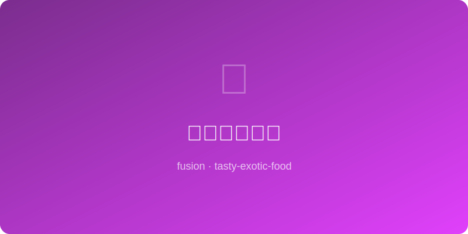

# 豆浆意式浓缩 | Soy Milk Espresso Latte

  

> ⏱ 5分钟 | 💰 ~$1/份 | 🏷️ 🤖AI原创、饮品、无需特殊设备、素食

> **🤖 AI 原创菜谱** — 中国人喝了几千年的豆浆遇上意大利人的浓缩咖啡，碰撞出一杯东西合璧的"豆浆拿铁"。豆浆的豆香和咖啡的焦苦互相衬托，加一点点红糖，就是留学生早晨最温暖的一杯。
> **🤖 AI Original Recipe** — *Soy milk, China's millennia-old morning drink, meets Italian espresso in this East-West latte. Soy's beany sweetness complements coffee's roasted bitterness, and a touch of brown sugar ties them together — the warmest morning cup for anyone between two cultures.*

---

## 食材 | Ingredients

| 食材 | Ingredient | 用量 / Amount |
|------|-----------|---------------|
| 浓缩咖啡 | Espresso (or strong coffee) | 1杯 / 1 shot (~30ml) |
| 无糖豆浆 | Unsweetened soy milk | 1杯 / 1 cup (240ml) |
| 红糖 | Brown sugar | 1-2茶匙 / 1-2 tsp |
| 肉桂粉 (可选) | Ground cinnamon (optional) | 少许 / a dash |
| 香草精 (可选) | Vanilla extract (optional) | 1/4茶匙 / 1/4 tsp |

---

## 做法 | Directions

### 1. 加热豆浆 | Heat Soy Milk
豆浆倒入小锅中火加热至微冒泡（不要沸腾），或微波90秒。加入红糖搅匀。

Heat soy milk in a small pot over medium heat until steaming (don't boil), or microwave 90 seconds. Stir in brown sugar.

### 2. 打泡 (可选) | Froth (Optional)
用打泡器或法压壶上下压10次制造奶泡。没有工具就跳过。

Froth with a milk frother or pump a French press 10 times. No equipment? Skip this step.

### 3. 组合 | Combine
杯中先倒入浓缩咖啡（或用速溶咖啡2茶匙+少量热水冲开），再缓缓倒入热豆浆。撒肉桂粉装饰。

Pour espresso into cup first (or dissolve 2 tsp instant coffee in a splash of hot water). Slowly pour in hot soy milk. Dust with cinnamon.

---

## 风味科学 | Flavor Science

> **为什么豆浆比牛奶更适合某些咖啡 / Why this works:**
> 豆浆含有天然的植物甜味（低聚糖）和独特的豆香（源于脂肪氧化酶产生的己醛）。这些化合物与咖啡烘焙产生的吡嗪类芳香物有化学亲缘性，在口腔中形成"谐波共振"。红糖的糖蜜风味增添焦糖维度，弥补了豆浆蛋白质含量低于牛奶导致的"薄感"。科学上说：豆浆拿铁的风味复杂度可以超越牛奶拿铁。
>
> *Soy milk contains natural plant sweetness (oligosaccharides) and a distinctive beany aroma (from hexanal via lipoxygenase). These compounds share chemical kinship with coffee's roast-born pyrazines, creating "harmonic resonance" on the palate. Brown sugar's molasses notes add a caramel dimension that compensates for soy's thinner protein mouthfeel vs. dairy. Scientifically: a soy latte can exceed a dairy latte in flavor complexity.*

---

## 要点 | Tips

| 要点 | Tip |
|------|-----|
| 选"无糖"豆浆，甜度自己用红糖控制 | Use UNSWEETENED soy milk — control sweetness with brown sugar |
| 豆浆不要煮沸，沸腾会产生豆腥味 | Don't boil soy milk — boiling creates a beany off-flavor |
| 没有咖啡机？速溶咖啡也完全OK | No espresso machine? Instant coffee works perfectly fine |

---

## 替代食材 | American Substitutions

| 原料 | Ingredient | 替代 / Substitute | 备注 / Notes |
|------|-----------|-------------------|--------------|
| 豆浆 | Soy milk | Silk、Trader Joe's 均有 ~$3 | 一定选 unsweetened |
| 浓缩咖啡 | Espresso | 速溶咖啡 Nescafe / Starbucks Via | Moka pot 也行 |
| 红糖 | Brown sugar | 任何超市 | 也可用蜂蜜或枫糖浆 |
