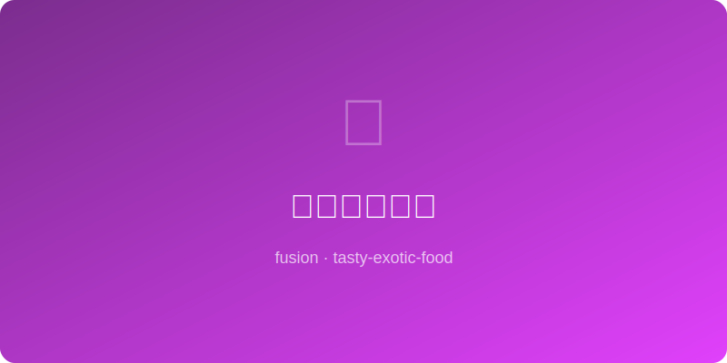

# 豆瓣酱汉堡酱 | Doubanjiang Burger Sauce

  

> 🤖 AI Original | ⏱ 准备 5分钟 + 烹饪 0分钟 | 💰 ~$1/份 | 🏷️ 融合创意、烧烤季、万能酱料

> 用郫县豆瓣酱改造美式汉堡酱——这一勺发酵辣椒酱替代了千岛酱和番茄酱的位置，为汉堡注入了深邃的鲜辣灵魂。从此你家的后院BBQ汉堡再也不会无聊了。
>
> *Reinvent American burger sauce with Pixian doubanjiang — one spoonful of fermented chili bean paste replaces Thousand Island and ketchup, injecting deep savory soul into your patty. Your backyard BBQ burgers will never be boring again.*

---

## 食材 | Ingredients

| 食材 | Ingredient | 用量 / Amount |
|------|-----------|---------------|
| 豆瓣酱 | Doubanjiang (finely chopped) | 1汤匙 / 1 tbsp |
| 蛋黄酱 | Mayonnaise | 3汤匙 / 3 tbsp |
| 番茄酱 | Ketchup | 1汤匙 / 1 tbsp |
| 酸黄瓜碎 | Diced dill pickles | 1汤匙 / 1 tbsp |
| 蒜泥 | Minced garlic | 1/2茶匙 / 1/2 tsp |
| 芝麻油 | Sesame oil | 1/2茶匙 / 1/2 tsp |

---

## 做法 | Directions

### 1. 剁碎豆瓣 | Mince the Paste
将豆瓣酱中的大块辣椒和蚕豆仔细剁碎至细腻均匀，这样酱料口感更顺滑。

Finely mince the chili and bean pieces in doubanjiang until smooth and uniform for better texture.

### 2. 混合所有 | Combine All
将所有食材放入碗中搅拌均匀。尝一下，按口味调整豆瓣酱（辣度）和番茄酱（甜度）的比例。

Combine all ingredients in a bowl, stir well. Taste and adjust doubanjiang (heat) and ketchup (sweetness) ratio.

### 3. 冷藏入味 | Rest & Use
冷藏15-30分钟让风味融合。涂在汉堡面包内侧，或作为蘸酱配薯条、鸡块。

Chill 15-30 min for flavors to meld. Spread inside burger buns, or use as a dip for fries and nuggets.

---

## 风味科学 | Flavor Science

豆瓣酱的核心风味来自蚕豆蛋白质在曲霉菌发酵下产生的游离谷氨酸（天然味精），其浓度是番茄酱的3-5倍，这就是为什么一勺豆瓣酱就能提供传统汉堡酱需要三四种调料才能达到的鲜味深度。酸黄瓜的乳酸发酵酸与豆瓣酱的有机酸叠加，在酱料中形成比单一酸源更丰富的酸味光谱。

*Doubanjiang's core flavor comes from free glutamate produced by Aspergillus fermentation of fava protein — at 3-5x ketchup's concentration, one spoonful delivers umami depth that traditional burger sauce needs three or four ingredients to match. Pickle's lactic acid stacks with doubanjiang's organic acids to create a richer acidity spectrum than any single acid source.*

---

## 替代食材 | Substitutions

| 原料 / Original | 替代 / Substitute | 备注 / Notes |
|-----------------|-------------------|--------------|
| 豆瓣酱 | 韩式辣酱 gochujang | 更甜更稠 / Sweeter, thicker |
| 蛋黄酱 | 日式蛋黄酱 Kewpie mayo | 更浓郁 / Richer, eggier |
| 酸黄瓜 | 泡菜碎 minced kimchi | 韩式混搭 / Korean twist |
