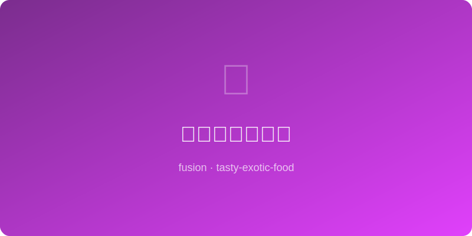

# 豆瓣酱芝士吐司 | Doubanjiang Cheese Toast

  

> **AI Original** - Fermented chili bean paste brings umami fire to gooey melted cheese toast

---

## 基本信息 | Basic Info

| 项目 | 详情 |
|------|------|
| 份量 Serves | 2片 |
| 准备时间 Prep | 5分钟 |
| 烹饪时间 Cook | 8分钟 |
| 难度 Difficulty | ★☆☆☆☆ |

---

## 食材 | Ingredients

- 厚切吐司 thick-sliced bread — 2片
- 郫县豆瓣酱 Pixian doubanjiang — 1大匙（剁细）
- 马苏里拉芝士 mozzarella — 80g（刨丝）
- 切达芝士 cheddar — 30g（刨丝）
- 黄油 butter — 15g（软化）
- 大蒜 garlic — 1瓣（压泥）
- 葱花 scallion — 适量
- 白芝麻 white sesame — 少许

---

## 做法 | Instructions

1. **调酱** — 软化黄油与蒜泥、豆瓣酱拌匀成辣酱黄油。
2. **涂抹** — 吐司单面均匀涂上辣酱黄油。
3. **铺芝士** — 先铺一层马苏里拉，再撒切达芝士。
4. **烤制** — 放入预热烤箱200°C (400°F) 上层，烤6-8分钟至芝士完全融化、边缘焦脆。
5. **装饰** — 出炉撒葱花和白芝麻，趁热享用。

---

## 小贴士 | Tips

- 豆瓣酱一定要剁细，大块会影响涂抹均匀度。
- 郫县豆瓣的发酵鲜味与芝士的奶香意外地契合。
- 怕辣可减少豆瓣酱用量或选用不太辣的品牌。
- 双层芝士（马苏拉丝+切达提味）是好吃的关键。
