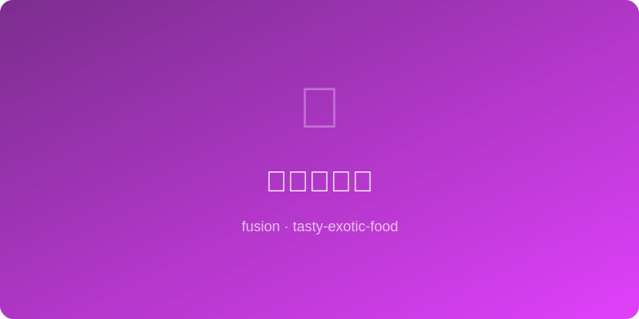

# 豆腐冰淇淋 | Tofu Ice Cream

  

> ⏱ 20分钟+冷冻4小时 | 💰~$4/份 | 🏷️ 🤖AI原创、融合菜、甜品、素食

> **🤖 AI 原创** — 嫩豆腐化身冰淇淋的丝滑基底，不需要蛋奶也能拥有意式Gelato的绵密，是大豆给甜品界的一封情书。
> **🤖 AI Original** — *Silken tofu becomes the velvety base of ice cream — no eggs, no dairy, yet Gelato-smooth. A love letter from soybeans to the dessert world.*

---

## 食材 | Ingredients
| 食材 | Ingredient | 用量 / Amount |
|------|-----------|---------------|
| 嫩豆腐 | Silken tofu | 300g / 10.5 oz |
| 椰奶 | Coconut cream | 200ml / ¾ cup |
| 蜂蜜或枫糖 | Honey or maple syrup | 80ml / ⅓ cup |
| 香草精 | Vanilla extract | 5ml / 1 tsp |
| 柠檬汁 | Lemon juice | 10ml / 2 tsp |
| 盐 | Salt | 1g / pinch |

---

## 做法 | Directions
### 1. 搅打成糊 | Blend Smooth
嫩豆腐沥水，与椰奶、蜂蜜、香草精、柠檬汁、盐一起用搅拌机打至丝滑无颗粒。
Drain silken tofu, blend with coconut cream, honey, vanilla, lemon juice, and salt until perfectly smooth.

### 2. 冷冻搅拌 | Freeze & Stir
倒入浅容器冷冻，每隔45分钟取出搅打一次，重复3次以打断冰晶。
Pour into a shallow container, freeze, and stir vigorously every 45 min — repeat 3 times to break ice crystals.

### 3. 回温上桌 | Temper & Serve
食用前冷藏回温10分钟至可挖取质地，配坚果碎或红豆。
Move to fridge 10 min before serving to reach scoopable texture. Top with crushed nuts or red beans.

---

## 风味科学 | Flavor Science
> 豆腐的大豆卵磷脂是天然乳化剂，模拟蛋黄在传统冰淇淋中的角色，椰奶的月桂酸提供类似乳脂的圆润口感。 *Tofu's soy lecithin is a natural emulsifier mimicking egg yolk's role in classic ice cream, while coconut cream's lauric acid delivers dairy-like richness.*

---

## 替代食材 | American Substitutions
| 原料 | Ingredient | 替代 / Substitute | 备注 / Notes |
|------|-----------|-------------------|-------------|
| 嫩豆腐 | Silken tofu | 腰果泡水打泥 / Soaked cashew paste | 更浓郁 / Richer flavor |
| 椰奶 | Coconut cream | 燕麦奶油 / Oat cream | 椰子味更淡 / Less coconut flavor |
| 蜂蜜 | Honey | 龙舌兰糖浆 / Agave syrup | 纯素友好 / Fully vegan |
