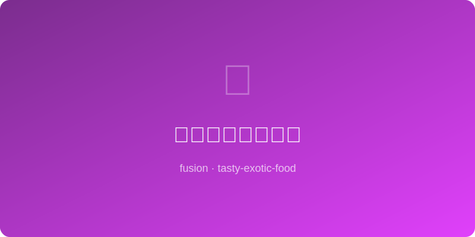

# 辣椒油拌豆腐沙拉 | Chili Oil Tofu Salad

  

> 🤖 AI Original — 嫩豆腐遇上香辣红油，植物蛋白的高光时刻

---

## 基本信息

- **难度**: ⭐ 超简单
- **时间**: 15 分钟
- **份量**: 2 人份
- **类型**: 凉菜 / 素食 / 轻食

---

## 食材清单

| 食材 | 用量 | 备注 |
|------|------|------|
| 嫩豆腐 | 1 盒 | 约 300g，内酯豆腐 |
| 辣椒油 | 3 大勺 | 自制或品牌红油 |
| 酱油 | 1 大勺 | 生抽 |
| 香醋 | 1 大勺 | 镇江香醋 |
| 白糖 | 1/2 小勺 | 提鲜 |
| 蒜泥 | 2 瓣 | 压成泥 |
| 小葱 | 2 根 | 切葱花 |
| 香菜 | 1 小把 | 切碎 |
| 花生碎 | 2 大勺 | 炒熟压碎 |
| 白芝麻 | 1 大勺 | 炒熟 |
| 混合生菜 | 100g | 垫底，可选 |
| 小番茄 | 4 个 | 对半切，可选 |

---

## 制作步骤

1. **豆腐脱水**: 嫩豆腐从盒中取出，放在盘中静置 5 分钟让多余水分自然流出，倒掉积水。
2. **调酱汁**: 辣椒油、酱油、香醋、白糖、蒜泥混合搅匀。
3. **铺底**: 盘中先铺一层混合生菜叶（可选），摆上小番茄。
4. **切豆腐**: 豆腐用勺子挖成不规则块状（或切成 2cm 方块），轻放在生菜上。
5. **淋酱**: 将调好的辣椒油酱汁均匀淋在豆腐表面。
6. **撒料**: 依次撒上花生碎、白芝麻、葱花和香菜碎。
7. **上桌**: 立刻享用，不需要翻拌，用勺子舀着吃。

---

## 小贴士

- 嫩豆腐非常脆弱，操作时要轻柔。
- 用勺子挖成不规则块比刀切更能挂住酱汁。
- 辣椒油是灵魂，建议用自制的带花椒和芝麻的版本。
- 加一点炸蒜酥或炸葱油渣，口感更加丰富。
- 素食者的优质蛋白来源，配杂粮饭就是完整一餐。

---

*🤖 AI Original Recipe — 嫩滑豆腐在辣椒油的红色怀抱中化身为最性感的素菜，花生碎的嘎嘣脆是最后的点睛之笔。*
