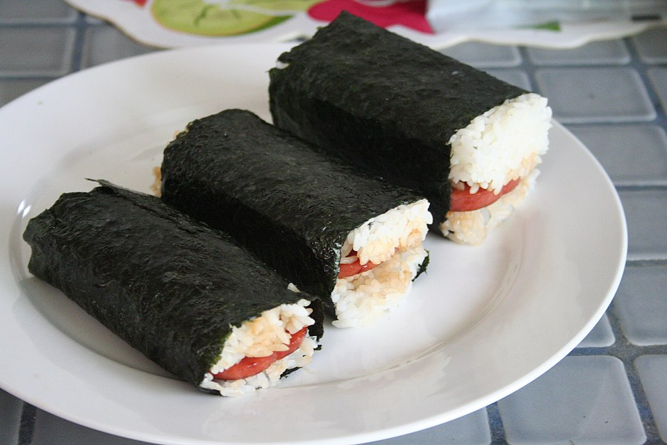

# 辣炒Spam饭 | Spicy Spam Fried Rice

> ⏱ 准备 5分钟 + 烹饪 8分钟 | 💰 ~$3/份 | 🏷️ AI原创、快手、宿舍可做、零浪费

  

> **🤖 AI 原创菜谱** — Spam 在美国是$3的罐头肉，在夏威夷和韩国却是国宝级食材。我把韩式辣椒酱(gochujang)的甜辣、Spam的咸鲜、隔夜饭的焦香三个维度组合起来，再加一个煎蛋打顶。这是蛋炒饭的"叛逆升级版"——当你连$5的外卖都不想花的时候，这碗饭让你觉得自己在吃$15的brunch。
>
> **🤖 AI Original Recipe** — *Spam is a $3 canned meat in America, but a national treasure in Hawaii and Korea. I combined gochujang's sweet heat, Spam's salty savoriness, and day-old rice's toasty crunch — topped with a fried egg. This is fried rice's "rebel upgrade." When you won't even spend $5 on takeout, this bowl makes you feel like you're eating $15 brunch.*

---

## 食材 | Ingredients

| 食材 | Ingredient | 用量 / Amount |
|------|-----------|---------------|
| 隔夜冷饭 | Day-old cold rice | 2碗 / 2 bowls |
| Spam 午餐肉 | Spam | 半罐切丁 / half can, diced |
| 韩式辣酱 | Gochujang | 1汤匙 / 1 tbsp |
| 酱油 | Soy sauce | 1汤匙 / 1 tbsp |
| 鸡蛋 | Eggs | 2个 / 2 (1个炒饭里，1个煎蛋) |
| 葱 | Scallion | 2根 / 2 stalks |
| 芝麻油 | Sesame oil | 1茶匙 / 1 tsp |
| 芝麻 | Sesame seeds | 少许 / for garnish |
| 泡菜 (可选) | Kimchi (optional) | 一小把切碎 / a handful, chopped |

---

## 做法 | Directions

### 1. 煎 Spam | Crisp the Spam
不加油（Spam 自带脂肪），中大火煎 Spam 丁至四面金黄酥脆。盛出。

No oil needed (Spam has plenty of fat). Pan-fry Spam cubes over medium-high heat until crispy on all sides. Set aside.

### 2. 炒饭 | Fry the Rice
同一口锅，打入1个鸡蛋炒散，加入冷饭大火翻炒2分钟。加入 gochujang 和酱油，继续翻炒至每粒米都上色。

In the same pan, scramble 1 egg, add cold rice and stir-fry 2 minutes over high heat. Add gochujang and soy sauce, keep tossing until every grain is coated.

### 3. 合并 | Combine
倒回 Spam 丁和泡菜（如果用的话），翻匀。淋芝麻油。

Return the Spam and kimchi (if using). Toss together. Drizzle sesame oil.

### 4. 煎蛋打顶 | Top with Egg
另一口锅煎一个溏心荷包蛋。炒饭盛碗，放上煎蛋，撒芝麻和葱花。戳破蛋黄，拌着吃。

Fry a sunny-side-up egg in another pan. Bowl the rice, top with the egg, sprinkle sesame and scallion. Break the yolk. Mix. Eat.

---

## 要点 | Tips

| 要点 | Tip |
|------|-----|
| Spam 要煎到酥脆，口感完全不同 | Crisp the Spam until it's crunchy — transforms the texture |
| Gochujang 比辣椒粉好，因为它自带甜味和发酵鲜味 | Gochujang > chili flakes — it brings sweetness AND fermented umami |
| 加泡菜是终极升级 | Adding kimchi is the ultimate upgrade |
| 这碗饭的精髓是戳破蛋黄那一刻 | The soul of this dish is the moment you break the yolk |

---

## 替代食材 | American Substitutions

| 原料 | Ingredient | 替代 / Substitute | 备注 / Notes |
|------|-----------|-------------------|--------------|
| Spam | Spam | 任��超市罐头区 ~$3 | 这本来就是美国产品！ |
| Gochujang | Gochujang | Walmart 亚洲区、Target、Whole Foods | Amazon ~$5 |
| 泡菜 | Kimchi | Trader Joe's / Costco / Whole Foods | 可选但推荐 |
