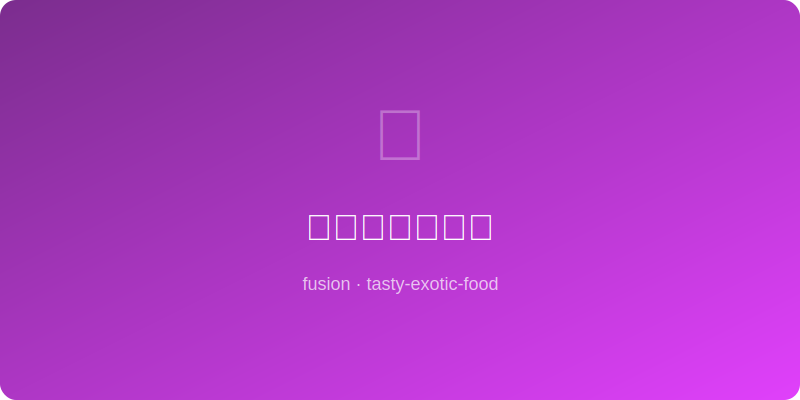

# 酱油焦糖爆米花 | Soy Caramel Popcorn

  

> **AI Original** - Addictive sweet-salty popcorn with soy sauce-laced caramel coating

---

## 基本信息 | Basic Info

| 项目 | 详情 |
|------|------|
| 份量 Serves | 4人份 |
| 准备时间 Prep | 5分钟 |
| 烹饪时间 Cook | 15分钟 |
| 难度 Difficulty | ★★☆☆☆ |

---

## 食材 | Ingredients

- 爆米花玉米粒 popcorn kernels — 80g
- 植物油 vegetable oil — 2大匙（爆玉米用）
- 白砂糖 sugar — 80g
- 生抽 light soy sauce — 1.5大匙
- 黄油 butter — 40g
- 蜂蜜 honey — 1大匙
- 海盐 sea salt — 1/4茶匙
- 白芝麻 white sesame — 1大匙
- 海苔碎 nori flakes — 可选

---

## 做法 | Instructions

1. **爆玉米花** — 大锅加油和3粒玉米粒，盖盖中火加热。听到那3粒爆开后倒入其余玉米粒，盖盖不断晃动锅，爆完后倒入大碗备用。
2. **制酱油焦糖** — 另起锅，中火加热白砂糖至融化成琥珀色焦糖。
3. **调味** — 离火加入黄油搅拌融合，再倒入生抽和蜂蜜（会冒泡），搅拌至顺滑。
4. **裹糖衣** — 将爆米花倒入焦糖中，快速翻拌让每颗都均匀裹上酱油焦糖。
5. **烤定型** — 铺在烤盘上，撒海盐和白芝麻，150°C烤8分钟让糖衣变脆。
6. **冷却** — 完全冷却后掰散，撒海苔碎，装入密封容器。

---

## 小贴士 | Tips

- 生抽的鲜味让焦糖爆米花有了令人停不下来的咸甜平衡。
- 焦糖温度很高，操作时务必小心。
- 完全冷却后才会变脆，不要心急。
- 密封保存可维持3-4天脆度。
