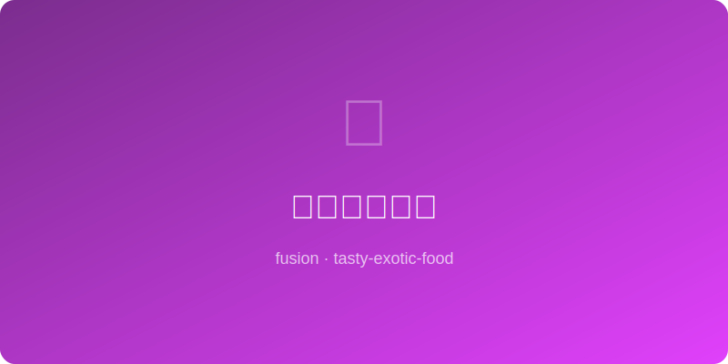

# 酱油焦糖苹果 | Soy Caramel Apple

  

> 🤖 AI Original | ⏱ 准备 5分钟 + 烹饪 10分钟 | 💰 ~$2/份 | 🏷️ 融合创意、秋季甜品、高级感

> 在经典焦糖苹果的糖浆中加入酱油——听起来疯狂，但酱油的氨基酸让焦糖的甜度获得了咸鲜支撑，就像给甜品加了味觉锚点。焦糖色更深、风味更复杂、回味更绵长。
>
> *Add soy sauce to classic caramel apple syrup — sounds crazy, but soy's amino acids give caramel's sweetness a savory anchor, like a flavor GPS for your taste buds. Darker color, deeper complexity, longer finish.*

---

## 食材 | Ingredients

| 食材 | Ingredient | 用量 / Amount |
|------|-----------|---------------|
| 苹果（脆甜型） | Crisp apples (Fuji, Honeycrisp) | 2个 / 2 |
| 白砂糖 | Granulated sugar | 1/2杯 / 1/2 cup |
| 淡奶油 | Heavy cream | 3汤匙 / 3 tbsp |
| 酱油 | Soy sauce | 1汤匙 / 1 tbsp |
| 黄油 | Butter | 1汤匙 / 1 tbsp |
| 海盐片 | Flaky sea salt | 少许 / a pinch |

---

## 做法 | Directions

### 1. 熬焦糖 | Make Caramel
中火干烧白糖，不要搅拌，轻轻晃锅使其均匀融化至琥珀色（约5-7分钟）。离火后迅速加入淡奶油（会剧烈冒泡，小心！），搅匀。

Dry-cook sugar over medium heat — don't stir, just swirl pan until amber (~5-7 min). Off heat, add cream quickly (it will bubble violently — careful!). Stir smooth.

### 2. 加酱油提味 | Add Soy Depth
加入酱油和黄油，搅拌至顺滑有光泽。酱油会让焦糖颜色变深、香气变复杂。

Stir in soy sauce and butter until glossy and smooth. Soy sauce will deepen the color and scent.

### 3. 淋苹果装盘 | Drizzle & Serve
苹果切厚片摆盘，淋上酱油焦糖酱，撒海盐片。也可以整个苹果插棍蘸酱。

Slice apples thick and arrange on plate. Drizzle soy caramel, sprinkle sea salt. Or dip whole apples on sticks.

---

## 风味科学 | Flavor Science

焦糖化反应产生数百种风味分子，酱油中已有的美拉德反应产物（酱色素等）与之叠加，创造出接近1000种风味化合物的超复杂味觉图谱。酱油中1-2%的乙醇还能在高温中携带挥发性香气分子，增强焦糖的"闻香"效果。

*Caramelization produces hundreds of flavor molecules; stacking them with soy sauce's pre-existing Maillard products (melanoidins etc.) approaches 1000 flavor compounds for an ultra-complex taste map. Soy's 1-2% ethanol also carries volatile aroma molecules at high heat, boosting caramel's "nose" effect.*

---

## 替代食材 | Substitutions

| 原料 / Original | 替代 / Substitute | 备注 / Notes |
|-----------------|-------------------|--------------|
| 酱油 | 鱼露 fish sauce 1/2tbsp | 更浓的鲜味，减量用 / Stronger umami, use half |
| 淡奶油 | 全脂椰奶 coconut cream | 纯素焦糖 / Vegan caramel |
| 苹果 | 梨 pear | 同样脆甜 / Similarly crisp-sweet |
