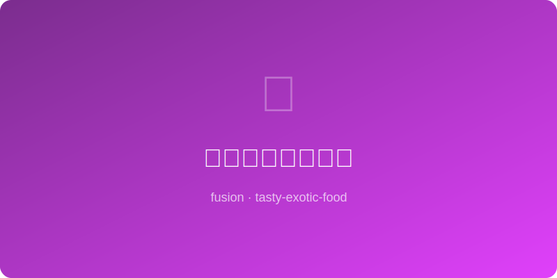

# 酱油蜂蜜烤杏鲍菇 Soy Honey Roasted King Oyster Mushroom

  

> 东亚 x 西方烤蔬菜 | 素食主菜
> East Asian x Western Roast Veg | Vegetarian Main

---

## 简介 Introduction

杏鲍菇是素食界的"牛排替身"——肉厚、弹韧、多汁。用酱油和蜂蜜调成的酱汁
刷在厚切杏鲍菇上，经过高温烤制后表面焦糖化，形成类似照烧的光泽。切开后
内部鲜嫩多汁，口感惊人地接近真正的牛排。这是一道连肉食者都会被征服的
素食融合菜。

King oyster mushroom is the vegetarian world's "steak stand-in" — thick,
springy, juicy. A soy-honey glaze brushed on thick-cut slices caramelizes
at high heat into a teriyaki-like sheen. Inside: tender and juicy, shockingly
close to real steak. A fusion vegetarian dish that converts even carnivores.

---

## 食材 Ingredients

| 食材 Ingredient | 用量 Amount |
|---|---|
| 大杏鲍菇 Large king oyster mushroom | 4根 / 4 |
| 酱油 Soy sauce | 30ml |
| 蜂蜜 Honey | 25ml |
| 蒜末 Minced garlic | 10g |
| 橄榄油 Olive oil | 20ml |
| 黑胡椒 Black pepper | 3g |
| 黄油 Butter | 20g |
| 百里香（可选）Fresh thyme | 2枝 / 2 sprigs |
| 柠檬汁 Lemon juice | 10ml |
| 白芝麻 White sesame | 5g |
| 葱花 Chopped scallion | 15g |

---

## 做法 Instructions

1. **切菇 Cut mushrooms**: 杏鲍菇纵切两半，在切面划十字花刀（深约5mm）。
   Halve mushrooms lengthwise, score crosshatch on cut side (~5mm deep).

2. **调酱 Make glaze**: 酱油、蜂蜜、蒜末、橄榄油、黑胡椒和柠檬汁混合均匀。
   Whisk soy sauce, honey, garlic, olive oil, pepper, and lemon juice.

3. **腌制 Marinate**: 将酱汁均匀刷在杏鲍菇切面上，腌制15分钟。
   Brush glaze generously on cut surfaces, marinate 15 min.

4. **煎制 Sear**: 平底锅大火加黄油，切面朝下煎3分钟至深褐色。
   Heat butter in a skillet on high, sear cut-side down 3 min until deep brown.

5. **翻面 Flip**: 翻面后加入百里香，浇上剩余酱汁，再煎2分钟。
   Flip, add thyme, spoon remaining glaze over, cook 2 more min.

6. **烤箱 Oven finish**: 如果菇较厚，可以200°C烤箱再烤5分钟确保熟透。
   For thicker mushrooms, finish in 200°C oven 5 min to cook through.

7. **装盘 Plate**: 撒白芝麻和葱花，可搭配土豆泥或沙拉食用。
   Top with sesame and scallion. Serve with mashed potatoes or salad.

---

*不用一块肉，却有牛排的灵魂。酱油和蜂蜜在菇面上写下融合的诗篇。*
*Not a gram of meat, yet it has a steak's soul. Soy and honey write a fusion poem on mushroom flesh.*
