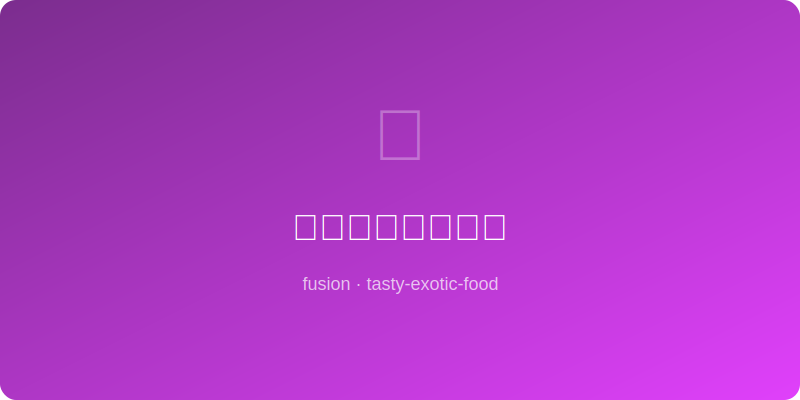

# 酱油蜂蜜烤玉米笋 | Soy Honey Baby Corn

  

> ⏱ 准备 5分钟 + 烹饪 12分钟 | 💰 ~$3/份 | 🏷️ 融合创意、AI原创、素食、快手菜

> 玉米笋裹上酱油蜂蜜酱汁在高温中烤到微焦——酱油的咸鲜和蜂蜜的甘甜在小巧的玉米笋上形成亮闪闪的釉面。口感脆嫩多汁，像在吃日式烧鸟风格的蔬菜串烧。五分钟准备，十二分满足。
>
> *Baby corn glazed in soy-honey sauce and roasted until charred at the edges — soy's savory depth and honey's golden sweetness form a glossy lacquer on these petite ears. Crisp-tender and juicy, like Japanese yakitori-style vegetable skewers. Five minutes of prep, twelve of satisfaction.*

---

## 食材 | Ingredients

| 食材 | Ingredient | 用量 / Amount |
|------|-----------|---------------|
| 玉米笋 | Baby corn (fresh or canned) | 250g |
| 酱油 | Soy sauce | 2汤匙 / 2 tbsp |
| 蜂蜜 | Honey | 1.5汤匙 / 1.5 tbsp |
| 蒜 | Garlic | 2瓣，切末 / 2 cloves, minced |
| 芝麻油 | Sesame oil | 1茶匙 / 1 tsp |
| 米醋 | Rice vinegar | 1茶匙 / 1 tsp |
| 辣椒片 (可选) | Red pepper flakes (optional) | 1/4茶匙 / 1/4 tsp |
| 白芝麻 | Sesame seeds | 装饰用 / for garnish |
| 葱花 | Scallion | 装饰用 / for garnish |

---

## 做法 | Directions

### 1. 调酱 | Make Glaze
酱油、蜂蜜、蒜末、芝麻油、米醋和辣椒片搅拌均匀。

Whisk together soy sauce, honey, garlic, sesame oil, rice vinegar, and pepper flakes.

### 2. 拌匀 | Coat
玉米笋沥干（罐头的要充分沥干），倒入酱汁拌匀。新鲜玉米笋先纵向对半切。

Drain baby corn thoroughly (especially canned). Toss with sauce. If using fresh, halve lengthwise first.

### 3. 烤制 | Roast
预热烤箱220°C或开broil。玉米笋单层铺开在烤盘上，烤10-12分钟，中途翻面一次，烤至边缘微焦。

Preheat oven to 220°C/425°F or use broiler. Spread corn in a single layer, roast 10-12 min, flip once, until edges char slightly.

### 4. 出盘 | Serve
撒芝麻和葱花，趁热上桌。可以作为配菜也可以串成串当小食。

Sprinkle sesame and scallions. Serve hot — works as a side dish or threaded onto skewers as a snack.

---

## 要点 | Tips

| 要点 | Tip |
|------|-----|
| 新鲜玉米笋口感远好于罐头，但罐头也能做 | Fresh baby corn is far superior, but canned works in a pinch |
| 罐头玉米笋必须彻底沥干，否则酱挂不住 | Canned corn must be fully drained or the glaze won't stick |
| 最后开broil 2分钟可以加速焦糖化 | A 2-min broil at the end speeds up caramelization |
| 穿竹签烤更有日式串烧的感觉 | Thread on bamboo skewers for a yakitori vibe |
