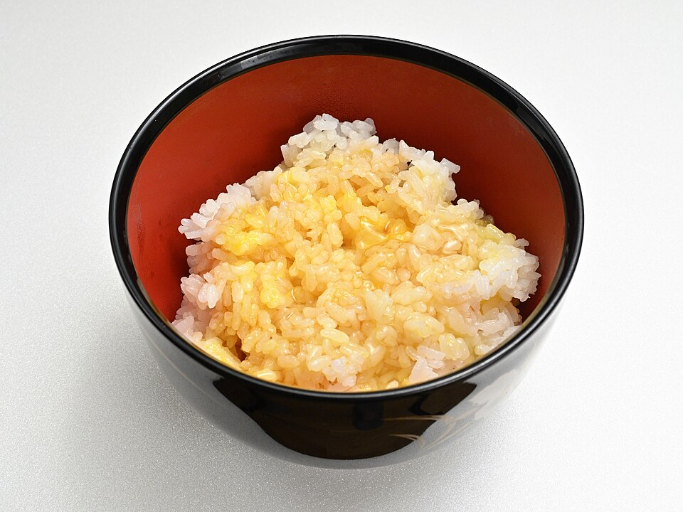

# 酱油黄油拌饭 | Soy Butter Rice

> ⏱ 2分钟 (无需烹饪) | 💰 ~$0.50/份 | 🏷️ 融合创意、深夜治愈、3种食材、宿舍可做

  

> 深夜两点，论文写不完，冰箱空空如也——但你有剩饭、一块黄油、一瓶酱油。把黄油埋进热饭里，淋上酱油，搅拌到每粒米都闪着光泽。这不是什么精致料理，这是留学生的深夜救赎。日本人叫它"卵かけご飯"的简化版，我们叫它"活下去的味道"。
>
> *2 AM. The paper's not done. The fridge is empty — but you have leftover rice, a pat of butter, and soy sauce. Bury the butter in hot rice, drizzle soy sauce, stir until every grain gleams. This isn't fine dining. This is a student's late-night salvation. The Japanese call a version of this "TKG." We call it "the taste of survival."*

---

## 食材 | Ingredients

| 食材 | Ingredient | 用量 / Amount |
|------|-----------|---------------|
| 热米饭 | Hot steamed rice | 1碗 / 1 bowl |
| 黄油 | Butter | 1大块 / 1 generous pat (~15g) |
| 酱油 | Soy sauce | 1-2汤匙 / 1-2 tbsp |

**进阶加料 / Level-up add-ons (可选 / optional):**

| 食材 | Ingredient | 效果 / What it adds |
|------|-----------|-------------------|
| 生蛋黄 | Raw egg yolk | 丝滑浓郁 / Silky richness |
| 芝麻 | Sesame seeds | 香脆 / Nutty crunch |
| 海苔碎 | Crushed nori | 鲜味 / Umami |
| 辣椒油 | Chili oil | 辣 / Heat |
| 鱼子酱风味海藻珠 | Seaweed caviar (Trader Joe's) | 爆浆口感 / Popping texture |

---

## 做法 | Directions

### 1. 热饭 | Hot Rice
米饭必须是热的。冷饭微波2分钟加热。

Rice must be HOT. Microwave cold rice for 2 minutes.

### 2. 埋黄油 | Bury the Butter
在饭中间挖个坑，把黄油埋进去，盖上米饭让它自己融化。

Dig a well in the center of the rice. Bury the butter, cover with rice, and let it melt on its own.

### 3. 淋酱油拌匀 | Drizzle & Mix
淋上酱油，从底部翻起来拌匀，直到每粒米都裹上金色的酱油黄油。

Drizzle soy sauce, fold from the bottom up until every grain is coated in a golden soy-butter glaze.

### 4. 吃 | Eat
闭眼吃第一口。感受幸福。

Close your eyes for the first bite. Feel the happiness.

---

## 要点 | Tips

| 要点 | Tip |
|------|-----|
| 用有盐黄油更好，咸香味更浓 | Salted butter is better — more savory depth |
| 酱油不要一次加太多，慢慢调 | Add soy sauce gradually — you can always add more |
| 加一个生蛋黄拌进去，升级为日式 TKG | Add a raw egg yolk for Japanese TKG vibes |
| 这道菜没有"正确"的做法，随心所欲 | There's no "right" way — make it yours |

---

## 替代食材 | American Substitutions

| 原料 | Ingredient | 替代 / Substitute | 备注 / Notes |
|------|-----------|-------------------|--------------|
| 黄油 | Butter | 任何超市 / Any supermarket | Kerrygold 更香 / Kerrygold is extra rich |
| 酱油 | Soy sauce | 任何超市 / Any supermarket | — |
| 米饭 | Rice | 任何超市 / Any supermarket | — |
