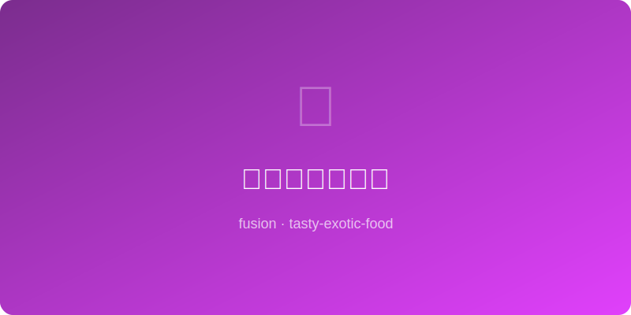

# 酱油黄油烤面包 | Soy Butter Toast

  

> 🤖 AI Original | ⏱ 准备 1分钟 + 烹饪 3分钟 | 💰 ~$0.5/份 | 🏷️ 融合创意、极简早餐、3分钟搞定

> 日本深夜食堂的灵魂小食——在烤得金黄的吐司上抹一层咸香黄油酱油。黄油的奶香、酱油的鲜咸、面包的焦香三者结合，比你想象的好吃一百倍。试一次就再也回不去普通黄油吐司了。
>
> *A late-night izakaya soul snack — golden toast spread with soy-spiked butter. Butter's cream, soy's salt, bread's toast char combine into something a hundred times better than you'd expect. One bite and you'll never go back to plain butter toast.*

---

## 食材 | Ingredients

| 食材 | Ingredient | 用量 / Amount |
|------|-----------|---------------|
| 厚切吐司 | Thick-cut bread / shokupan | 1片 / 1 slice |
| 黄油（室温软化） | Butter (room temp) | 1汤匙 / 1 tbsp |
| 酱油 | Soy sauce | 1茶匙 / 1 tsp |
| 蜂蜜（可选） | Honey (optional) | 1/2茶匙 / 1/2 tsp |
| 白芝麻 | White sesame seeds | 少许 / a pinch |

---

## 做法 | Directions

### 1. 调酱油黄油 | Make Soy Butter
软化黄油中加入酱油（和蜂蜜，如用），用叉子搅拌均匀至颜色变为浅棕色。

Mix soy sauce (and honey, if using) into softened butter with a fork until light brown and uniform.

### 2. 烤面包 | Toast the Bread
吐司放入烤面包机或烤箱，烤至金黄酥脆（约2-3分钟）。

Toast bread until golden and crisp (~2-3 min in toaster or oven).

### 3. 涂抹即食 | Spread & Eat
趁热在吐司上厚厚地抹一层酱油黄油，撒白芝麻。趁酱油黄油还在微微融化时大口咬下。

Spread soy butter generously on hot toast, sprinkle sesame. Bite in while the butter is still melting.

---

## 风味科学 | Flavor Science

酱油中含有超过300种挥发性香气化合物，与黄油加热后产生的双乙酰（奶油香核心分子）形成极其丰富的香气矩阵。面包的美拉德反应产物与酱油的氨基酸形成新的风味化合物，这就是为什么这个组合"闻起来比吃起来还香"。

*Soy sauce contains 300+ volatile aroma compounds that combine with butter's diacetyl (the core cream-flavor molecule) into an extraordinarily rich aroma matrix. Bread's Maillard products react with soy amino acids to form novel flavor compounds — that's why this combo "smells even better than it tastes."*

---

## 替代食材 | Substitutions

| 原料 / Original | 替代 / Substitute | 备注 / Notes |
|-----------------|-------------------|--------------|
| 黄油 | 咸味植物黄油 vegan butter | 纯素 / Vegan-friendly |
| 酱油 | 日式溜酱油 tamari | 无麸质 / Gluten-free |
| 厚切吐司 | 法棍切片 baguette slices | 更脆 / Crunchier texture |
