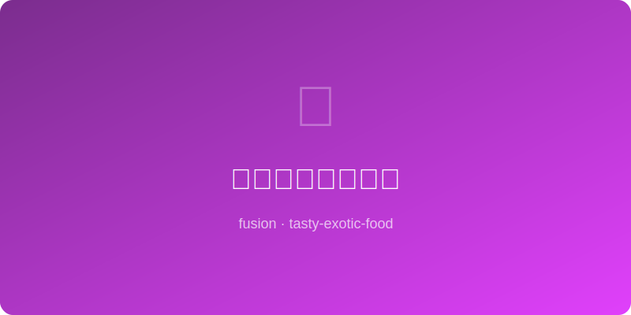

# 黑糖姜汁珍珠奶茶 | Brown Sugar Ginger Boba

  

> ⏱ 35分钟 | 💰~$4/份 | 🏷️ 🤖AI原创、融合菜、饮品、台湾×东南亚

> **🤖 AI 原创** — 台式珍珠奶茶的黑糖虎纹里加入一道姜汁闪电，暖胃与解馋在同一杯中达成和解。
> **🤖 AI Original** — *A bolt of ginger lightning strikes through Taiwanese boba's brown sugar tiger stripes — warming your belly and satisfying your craving in a single cup.*

---

## 食材 | Ingredients
| 食材 | Ingredient | 用量 / Amount |
|------|-----------|---------------|
| 黑糖珍珠 | Brown sugar tapioca pearls | 80g / ⅓ cup |
| 红茶茶包 | Black tea bags | 2个 / 2 |
| 全脂牛奶 | Whole milk | 200ml / ¾ cup |
| 黑糖 | Dark brown sugar / muscovado | 40g / 3 tbsp |
| 老姜汁 | Fresh ginger juice | 15ml / 1 tbsp |
| 热水 | Hot water | 200ml / ¾ cup |

---

## 做法 | Directions
### 1. 煮珍珠 | Cook Boba
珍珠按包装煮熟（通常大火煮20分钟闷10分钟），捞出拌入一半黑糖浆备用。
Cook boba per package (usually boil 20 min + rest 10 min), drain and toss with half the brown sugar syrup.

### 2. 泡茶调味 | Brew & Flavor
红茶热水泡5分钟取出茶包，加入剩余黑糖和姜汁搅匀，放凉。
Steep tea in hot water 5 min, remove bags, stir in remaining brown sugar and ginger juice. Let cool.

### 3. 组装 | Assemble
杯中先放黑糖珍珠，倒入姜味茶汤，最后沿勺背缓注牛奶形成分层，插粗吸管搅拌享用。
Spoon sugared boba into glass, pour ginger tea, slowly layer milk over the back of a spoon. Insert fat straw, stir, and enjoy.

---

## 风味科学 | Flavor Science
> 黑糖的焦糖醛（furfural）与姜辣素形成温暖的芳香协同；茶多酚与牛奶酪蛋白结合减少涩感，珍珠的木薯淀粉提供咀嚼愉悦。 *Brown sugar's furfural synergizes with gingerol for warm aromatics; tea polyphenols bind with milk casein to reduce astringency, while boba's tapioca starch delivers chewing pleasure.*

---

## 替代食材 | American Substitutions
| 原料 | Ingredient | 替代 / Substitute | 备注 / Notes |
|------|-----------|-------------------|-------------|
| 黑糖 | Brown sugar/muscovado | 红糖+糖蜜 / Brown sugar + molasses | 模拟深色风味 / Mimics dark flavor |
| 老姜汁 | Fresh ginger juice | 姜粉1tsp / Ground ginger 1 tsp | 方便版 / Convenience swap |
| 全脂牛奶 | Whole milk | 燕麦奶 / Oat milk | 植物基版本 / Plant-based option |
