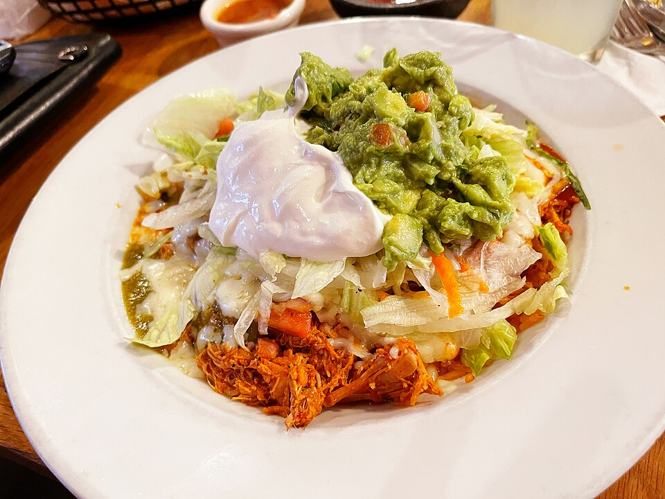

# 墨西哥鸡肉卷 | Chicken Burrito Bowl

  

> 在美国吃过 Chipotle 吗？那个让你排队半小时的 burrito bowl，其实自己做超简单。鸡腿肉用墨西哥调味料煎一下，配上米饭、黑豆、玉米、牛油果和酸奶油——比 Chipotle 便宜一半，份量大一倍。
>
> *Ever waited in that Chipotle line? The burrito bowl you queue 30 minutes for is actually dead simple to make at home. Season chicken thighs with taco spice, sear them, and pile on rice, black beans, corn, avocado, and sour cream. Half the price, double the portion.*

---

## 食材 | Ingredients

| 食材 | Ingredient | 用量 / Amount |
|------|-----------|---------------|
| 鸡腿肉 | Chicken thighs (boneless) | 300g |
| 墨西哥调味粉 | Taco seasoning | 2汤匙 / 2 tbsp |
| 米饭 | Cooked rice | 2碗 / 2 bowls |
| 黑豆罐头 | Canned black beans | 半罐 / half can |
| 玉米粒 | Corn (canned or frozen) | 半杯 / half cup |
| 牛油果 | Avocado | 1个 / 1 |
| 番茄 | Tomato | 1个 / 1 (diced) |
| 酸奶油 | Sour cream | 适量 / to taste |
| 芝士碎 | Shredded cheese | 适量 / to taste |
| 青柠 | Lime | 1个 / 1 |
| 盐 | Salt | 适量 / to taste |
| 橄榄油 | Olive oil | 1汤匙 / 1 tbsp |

---

## 做法 | Directions

### 1. 腌鸡肉 | Season the Chicken
鸡腿肉撒上 taco seasoning 和少许盐，抹匀，腌10分钟。

Coat chicken thighs with taco seasoning and a pinch of salt. Let sit 10 minutes.

### 2. 煎鸡肉 | Sear the Chicken
锅中热橄榄油，中大火煎鸡肉，每面4-5分钟至金黄熟透。取出切片或切块。

Heat olive oil in a pan. Sear chicken over medium-high heat, 4–5 minutes per side until golden and cooked through. Remove and slice or dice.

### 3. 准备配料 | Prep the Toppings
黑豆沥干冲洗，玉米沥干（或微波冷冻玉米），牛油果切片，番茄切丁。

Drain and rinse black beans. Drain corn (or microwave frozen corn). Slice avocado. Dice tomato.

### 4. 组装 | Assemble the Bowl
碗底铺米饭，上面摆上鸡肉、黑豆、玉米、番茄、牛油果。挤青柠汁，加酸奶油和芝士碎。

Layer rice at the bottom. Top with chicken, black beans, corn, tomato, and avocado. Squeeze lime, add sour cream and shredded cheese.

---

## 要点 | Tips

| 要点 | Tip |
|------|-----|
| 用鸡腿肉不用鸡胸肉，更嫩更多汁 | Use thighs, not breast — juicier and more forgiving |
| 米饭可以拌一点青柠汁和盐，模仿 Chipotle 的 cilantro lime rice | Mix rice with lime juice + salt for Chipotle's cilantro lime rice vibe |
| 所有配料可以提前 meal prep 好 | All toppings can be meal-prepped in advance |
| 用玉米饼 (tortilla) 包起来就是 burrito | Wrap it in a tortilla and it becomes a burrito |

---

## 替代食材 | American Substitutions

| 原料 | Ingredient | 替代 / Substitute | 备注 / Notes |
|------|-----------|-------------------|--------------|
| 鸡腿肉 | Chicken thighs | 任何超市 / Any supermarket | Costco 大包装最划算 |
| Taco seasoning | Taco seasoning | 任何超市香料区 / Spice aisle everywhere | Old El Paso、McCormick 品牌 |
| 黑豆罐头 | Canned black beans | 任何超市罐头区 / Canned aisle | ~$1/罐 |
| 牛油果 | Avocado | 任何超市 / Any supermarket | 选摸起来微软的 / Choose ones that yield slightly to pressure |
| 酸奶油 | Sour cream | 任何超市 / Any supermarket | 也可用 Greek yogurt 替代 |

---

## 需要的工具 | Equipment

| 工具 | Tool | 替代 / Substitute |
|------|------|-------------------|
| 平底锅 | Skillet | 任何锅 / Any pan |
| 电饭锅 | Rice cooker | Instant Pot 或锅煮 / Instant Pot or stovetop |
