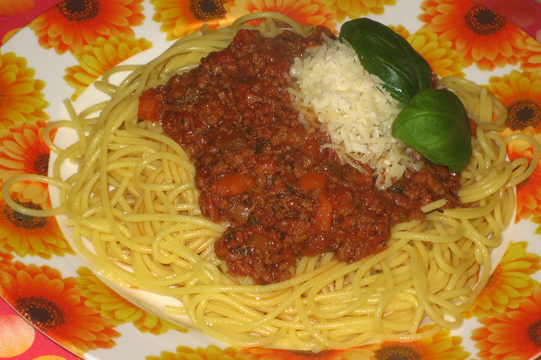

# 意式番茄肉酱面 | Spaghetti Bolognese

> ⏱ 准备 10分钟 + 烹饪 30分钟 | 💰 ~$3/份 | 🏷️ 意大利、Meal Prep、全超市可买

  

> 留学生吃中国菜吃腻了怎么办？来一盘意大利肉酱面换换口味。这是全世界最简单的西餐之一——超市买盒意面、一罐番茄酱、一包牛肉馅，半小时就能做出餐厅级别的味道。做一大锅肉酱冷冻起来，可以吃一个月。
>
> *Tired of Chinese food? Switch it up with Spaghetti Bolognese — one of the easiest Western dishes in the world. Grab a box of pasta, a jar of marinara, and some ground beef from any supermarket. In thirty minutes, you'll have restaurant-quality pasta. Make a big batch of sauce and freeze it — it lasts a month.*

---

## 食材 | Ingredients

| 食材 | Ingredient | 用量 / Amount |
|------|-----------|---------------|
| 意面 | Spaghetti | 200g |
| 牛肉馅 (或混合肉馅) | Ground beef (or beef-pork mix) | 300g |
| 洋葱 | Onion | 1个 / 1 |
| 蒜 | Garlic | 3瓣 / 3 cloves |
| 罐装番茄 | Canned crushed tomatoes | 1罐 (400g / 14 oz) |
| 番茄酱 | Tomato paste | 2汤匙 / 2 tbsp |
| 橄榄油 | Olive oil | 2汤匙 / 2 tbsp |
| 盐 | Salt | 适量 / to taste |
| 黑胡椒 | Black pepper | 适量 / to taste |
| 意大利综合香料 | Italian seasoning | 1茶匙 / 1 tsp |
| 帕尔马干酪 (可选) | Parmesan cheese (optional) | 适量 / for topping |

---

## 做法 | Directions

### 1. 炒肉酱 | Make the Sauce
锅中热橄榄油，放入切碎的洋葱炒至透明。加蒜末炒香。放入牛肉馅，炒散至完全变色。

Heat olive oil in a pan. Sauté diced onion until translucent. Add minced garlic and cook until fragrant. Add ground beef and cook, breaking it up, until fully browned.

### 2. 加番茄 | Add Tomatoes
倒入罐装番茄和番茄酱，加意大利综合香料、盐、黑胡椒。搅匀后转小火，加盖慢煮20分钟。

Pour in crushed tomatoes and tomato paste. Add Italian seasoning, salt, and pepper. Stir, reduce to low heat, cover, and simmer 20 minutes.

### 3. 煮面 | Cook the Pasta
另起一大锅水烧开，加一大勺盐（水要咸如海水），下意面煮至包装上标注的时间减1分钟（al dente）。

Bring a large pot of water to a rolling boil. Add a generous amount of salt (it should taste like the sea). Cook spaghetti for 1 minute less than the package says (al dente).

### 4. 合并 | Combine
捞出面条（留一杯煮面水），放入肉酱锅中翻拌。如果太干加些煮面水。盛出，撒帕尔马干酪。

Drain the pasta (save 1 cup of pasta water). Add to the sauce and toss. If too thick, add a splash of pasta water. Plate and top with Parmesan cheese.

---

## 要点 | Tips

| 要点 | Tip |
|------|-----|
| 煮面水要加够盐，这是给面调味的唯一机会 | Salt the pasta water generously — it's your only chance to season the noodles |
| 面条不要煮太软，比包装时间少1分钟 | Cook pasta 1 minute less than the box says — al dente is the goal |
| 留一杯煮面水！淀粉水能让酱汁更浓稠 | Save pasta water! The starchy water helps the sauce cling to the noodles |
| 肉酱煮越久越好，周末可以慢炖2小时 | The longer the sauce simmers, the better — simmer 2 hours on weekends |
| 做一大锅分装冷冻，随时有现成肉酱 | Make a big batch and freeze portions — instant sauce anytime |

---

## 替代食材 | American Substitutions

| 原料 | Ingredient | 替代 / Substitute | 备注 / Notes |
|------|-----------|-------------------|--------------|
| 意面 | Spaghetti | 任何超市，$1-2/盒 / Any supermarket, $1-2/box | Barilla 或 De Cecco 品牌推荐 / Barilla or De Cecco recommended |
| 牛肉馅 | Ground beef | 任何超市 / Any supermarket | 80/20 比例最佳 / 80/20 lean-to-fat is best |
| 罐装番茄 | Canned tomatoes | 任何超市 / Any supermarket | San Marzano 最好 / San Marzano is premium |
| 意大利香料 | Italian seasoning | 任何超市香料区 / Spice aisle anywhere | McCormick 品牌 |
| 帕尔马干酪 | Parmesan | Trader Joe's / Costco / Walmart | 买一块现刨最好 / A block for grating is best |

---

## 需要的工具 | Equipment

| 工具 | Tool | 替代 / Substitute |
|------|------|-------------------|
| 大汤锅 (煮面) | Large pot (for boiling pasta) | 必须够大，面条要有空间 / Must be big enough for noodles to move freely |
| 平底煎锅 (炒酱) | Skillet or saucepan (for sauce) | 任何锅 / Any pan |
| 漏勺 | Colander / strainer | 或用锅盖挡着倒水 / Or hold the lid and pour |
