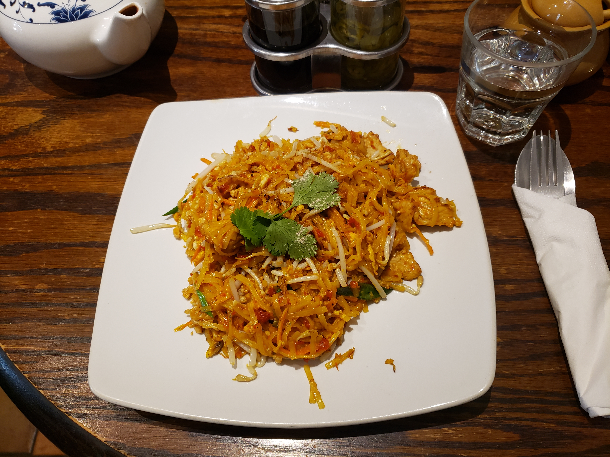

# 泰式炒河粉 | Pad Thai

> ⏱ 准备 25分钟 (含泡面) + 烹饪 10分钟 | 💰 ~$5/份 | 🏷️ 泰国、需要亚洲超市(河粉/鱼露)

  

> 泰国街头最经典的一碗面——酸甜咸鲜辣五味平衡，花生碎和青柠汁画龙点睛。在美国的亚洲超市买一包河粉、一瓶鱼露和一包花生，就能在家做出让室友惊叹的 Pad Thai。
>
> *Thailand's most iconic street noodle — a perfect balance of sour, sweet, salty, savory, and spicy, finished with crushed peanuts and a squeeze of lime. Grab rice noodles, fish sauce, and peanuts from an Asian market, and you can make a Pad Thai that'll blow your roommates away.*

---

## 食材 | Ingredients

| 食材 | Ingredient | 用量 / Amount |
|------|-----------|---------------|
| 干河粉 | Dried rice noodles (pad thai width) | 200g |
| 虾仁或鸡肉 | Shrimp or chicken | 150g |
| 鸡蛋 | Eggs | 2个 / 2 |
| 豆芽 | Bean sprouts | 1杯 / 1 cup |
| 韭菜或葱 | Garlic chives or scallions | 一小把 / a small bunch |
| 花生碎 | Crushed roasted peanuts | 3汤匙 / 3 tbsp |
| 青柠 | Lime | 1个 / 1 |
| **酱汁 / Sauce:** | | |
| 鱼露 | Fish sauce | 3汤匙 / 3 tbsp |
| 白糖或棕榈糖 | Sugar or palm sugar | 2汤匙 / 2 tbsp |
| 罗望子酱 | Tamarind paste | 2汤匙 / 2 tbsp |
| 辣椒粉 | Chili flakes | 1茶匙 / 1 tsp |
| 植物油 | Vegetable oil | 2汤匙 / 2 tbsp |

---

## 做法 | Directions

### 1. 泡面 | Soak the Noodles
干河粉用温水泡软（约20分钟），沥干。不要泡过头，面条应该还有些硬。

Soak dried rice noodles in warm water for ~20 minutes until pliable. Drain. Don't over-soak — they should still be slightly firm.

### 2. 调酱 | Mix the Sauce
碗中混合鱼露、糖、罗望子酱和辣椒粉，搅匀。

Combine fish sauce, sugar, tamarind paste, and chili flakes in a bowl. Stir until the sugar dissolves.

### 3. 炒蛋和蛋白质 | Cook Protein & Eggs
大火热油，炒虾仁或鸡肉至熟，盛出。同一锅打入鸡蛋，炒散。

Heat oil over high heat. Cook shrimp or chicken until done, set aside. In the same wok, scramble the eggs.

### 4. 炒面 | Stir-fry the Noodles
放入河粉，倒入调好的酱汁，大火翻炒2分钟至面条吸收酱汁。倒回虾仁/鸡肉，加入豆芽和韭菜，快速翻炒30秒。

Add the drained noodles and pour in the sauce. Stir-fry 2 minutes over high heat until noodles absorb the sauce. Return the protein, add bean sprouts and chives. Toss 30 seconds.

### 5. 装盘 | Plate
盛出，撒花生碎，挤青柠汁。

Plate, sprinkle with crushed peanuts, and squeeze lime over the top.

---

## 要点 | Tips

| 要点 | Tip |
|------|-----|
| 河粉泡到能弯曲但不软塌就好 | Soak noodles until bendable but still firm — they'll finish cooking in the wok |
| 大火是关键，锅要热到冒烟 | High heat is critical — the wok must be screaming hot |
| 花生和青柠不能省，是点睛之笔 | Peanuts and lime are non-negotiable — they complete the dish |
| 没有罗望子酱可以用醋+糖替代 | No tamarind? Use 1 tbsp vinegar + 1 tbsp sugar |

---

## 替代食材 | American Substitutions

| 原料 | Ingredient | 替代 / Substitute | 备注 / Notes |
|------|-----------|-------------------|--------------|
| 干河粉 | Rice noodles | 亚洲超市；Walmart 有 Thai Kitchen 品牌 | Amazon 也有 / Also on Amazon |
| 鱼露 | Fish sauce | Walmart/Target 亚洲区有 Thai Kitchen 品牌 | 三蟹牌（亚洲超市）最正宗 / Three Crabs brand is best |
| 罗望子酱 | Tamarind paste | 亚洲超市/Amazon；替代：lime juice + brown sugar | — |
| 豆芽 | Bean sprouts | Trader Joe's / Whole Foods / 亚洲超市 | — |
| 花生 | Peanuts | 任何超市 / Any supermarket | — |
| 青柠 | Lime | 任何超市 / Any supermarket | — |

---

## 需要的工具 | Equipment

| 工具 | Tool | 替代 / Substitute |
|------|------|-------------------|
| 炒锅 | Wok | 大号平底锅 / Large skillet works |
| 锅铲 | Wok spatula | 任何大铲子 / Any large spatula |
