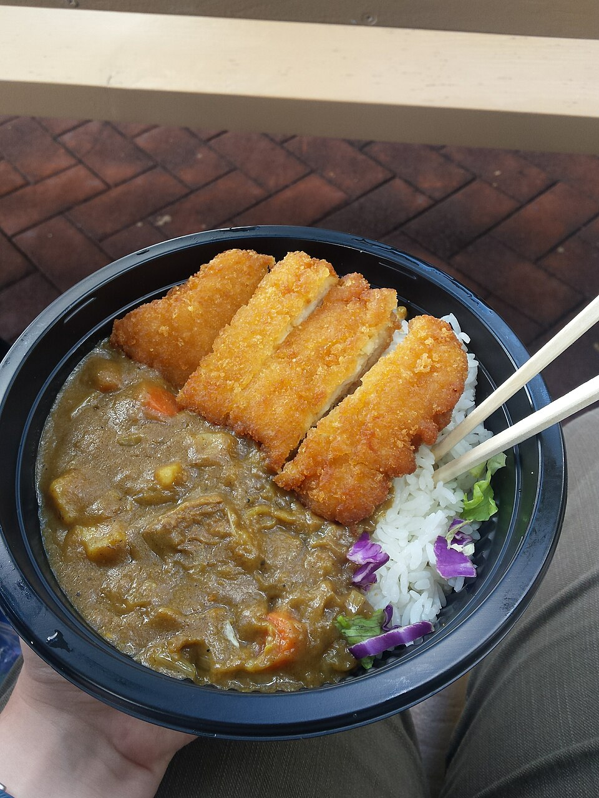

# 咖喱鸡饭 | Curry Chicken Rice

  

> 日式咖喱在中国留学生中人气极高——买一盒咖喱块，切几样菜，一锅炖，浇在米饭上就是一顿饱饱的晚餐。做一大锅够吃两三天，是留学生 meal prep 的神器。
>
> *Japanese-style curry is wildly popular among Chinese students — grab a box of curry roux, chop a few vegetables, simmer in one pot, and pour over rice for a hearty dinner. Make a big batch and it lasts 2–3 days — the ultimate student meal prep.*

---

## 食材 | Ingredients

| 食材 | Ingredient | 用量 / Amount |
|------|-----------|---------------|
| 鸡腿肉 | Chicken thighs (boneless, skinless) | 400g |
| 土豆 | Potatoes | 2个 / 2 medium |
| 胡萝卜 | Carrots | 1根 / 1 |
| 洋葱 | Onion | 1个 / 1 |
| 咖喱块 | Curry roux (Japanese-style) | 半盒 / half box (~100g) |
| 水 | Water | 600ml |
| 植物油 | Vegetable oil | 1汤匙 / 1 tbsp |
| 米饭 | Cooked rice | 适量 / as needed |

---

## 做法 | Directions

### 1. 切料 | Prep
鸡腿肉切块，土豆和胡萝卜切滚刀块，洋葱切丁。

Cut chicken into bite-sized pieces. Cut potatoes and carrots into rough chunks. Dice the onion.

### 2. 炒料 | Sauté
锅中热油，先炒洋葱至透明，加入鸡块炒至变色，再加土豆和胡萝卜翻炒2分钟。

Heat oil in a pot. Sauté onion until translucent. Add chicken and cook until the surface turns white. Add potatoes and carrots, stir-fry 2 minutes.

### 3. 炖煮 | Simmer
加入600ml水，大火烧开后转小火，加盖炖20分钟至蔬菜软烂。

Add 600 ml water. Bring to a boil, reduce to low heat, cover, and simmer 20 minutes until vegetables are tender.

### 4. 加咖喱块 | Add Curry Roux
关火，放入咖喱块，搅拌至完全融化。再开小火煮5分钟至汤汁浓稠。

Turn off the heat. Add curry roux and stir until fully dissolved. Return to low heat and simmer 5 more minutes until the sauce thickens.

### 5. 浇饭 | Serve Over Rice
将咖喱浇在热米饭上即可。

Ladle the curry over hot steamed rice and serve.

---

## 要点 | Tips

| 要点 | Tip |
|------|-----|
| 咖喱块要关火后再放，防止结块 | Add curry roux with the heat OFF to prevent lumps |
| 隔夜咖喱更入味 | Overnight curry tastes even better — flavors deepen |
| 可以加任何蔬菜：西兰花、蘑菇、甜椒 | Add any vegetables you like: broccoli, mushrooms, bell peppers |
| 一次做一大锅，分装冷冻，随时热 | Make a big batch, portion, and freeze for easy reheating |

---

## 替代食材 | American Substitutions

| 原料 | Ingredient | 替代 / Substitute | 备注 / Notes |
|------|-----------|-------------------|--------------|
| 咖喱块 | Curry roux | Golden Curry 或 Vermont Curry 品牌 | Target、Walmart 亚洲区、Amazon 都有 / Available at Target, Walmart Asian aisle, Amazon |
| 鸡腿肉 | Chicken thighs | 任何超市 / Any supermarket | Costco 大包装最划算 / Costco bulk is best value |
| 土豆 | Potatoes | Yukon Gold 或 Russet | 任何超市 / Any supermarket |
| 洋葱 | Onion | Yellow onion | 任何超市 / Any supermarket |
| 米饭 | Rice | 任何大米；Instant Pot 煮饭最方便 | Costco Calrose rice 性价比高 / Costco Calrose rice is great value |
