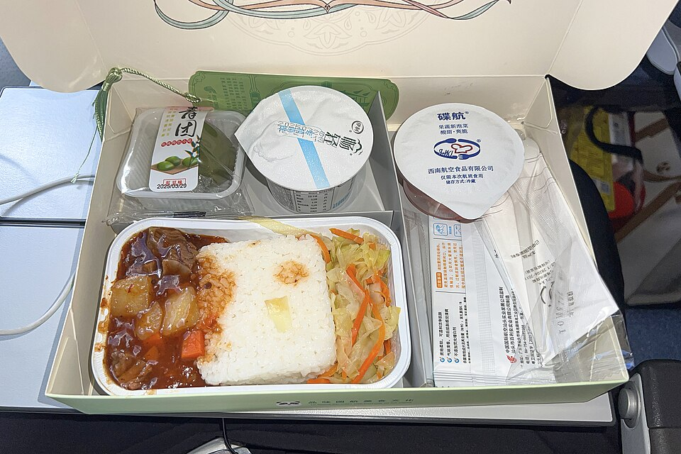

# 红烧牛腩 | Braised Beef Brisket

> ⏱ 准备 15分钟 + 烹饪 3小时 (Instant Pot 45分钟) | 💰 ~$5/份 (Costco) | 🏷️ 一锅出、Meal Prep、周末项目

  

> 红烧牛腩是留学生的"周末大菜"——周六下午花半小时准备，炖上三个小时，整个公寓都是肉香。一大锅配面、配饭、配馒头，够吃一个星期。Costco 的牛腩又大又便宜，是性价比之王。
>
> *Braised beef brisket is the "weekend project" of student cooking — spend 30 minutes prepping on a Saturday afternoon, let it simmer for 3 hours, and your whole apartment fills with the aroma of slow-braised meat. One big pot pairs with rice, noodles, or bread, and feeds you for a week. Costco brisket is huge and cheap — unbeatable value.*

---

## 食材 | Ingredients

| 食材 | Ingredient | 用量 / Amount |
|------|-----------|---------------|
| 牛腩 | Beef brisket (or beef chuck) | 1000g |
| 土豆 | Potatoes | 2个 / 2 medium |
| 胡萝卜 | Carrots | 2根 / 2 |
| 洋葱 | Onion | 1个 / 1 |
| 姜 | Ginger | 5片 / 5 slices |
| 葱 | Scallion | 3根 / 3 stalks |
| 八角 | Star anise | 2颗 / 2 pieces |
| 桂皮 | Cinnamon stick | 1小段 / 1 small piece |
| 酱油 | Soy sauce | 4汤匙 / 4 tbsp |
| 老抽 | Dark soy sauce | 1汤匙 / 1 tbsp |
| 料酒 | Shaoxing wine | 3汤匙 / 3 tbsp |
| 冰糖或白糖 | Rock sugar or white sugar | 2汤匙 / 2 tbsp |
| 盐 | Salt | 适量 / to taste |
| 植物油 | Vegetable oil | 2汤匙 / 2 tbsp |

---

## 做法 | Directions

### 1. 焯水 | Blanch
牛腩切大块（约4cm），冷水下锅加姜片，烧开后焯水5分钟。捞出洗净。

Cut brisket into large chunks (~4 cm). Place in cold water with ginger. Bring to a boil, blanch 5 minutes. Remove and rinse.

### 2. 炒糖色 | Caramelize Sugar
锅中热油，放入冰糖小火炒至融化变深棕色，放入牛腩翻炒上色。

Heat oil in a heavy pot. Add sugar and stir over low heat until it melts and turns dark amber. Add the beef and toss to coat.

### 3. 加料炖煮 | Braise
加入葱段、姜片、八角、桂皮，倒入酱油、老抽、料酒。加热水没过牛腩。大火烧开后转最小火，加盖炖2小时。

Add scallion, ginger, star anise, and cinnamon. Pour in soy sauce, dark soy sauce, and wine. Add hot water to cover the beef. Bring to a boil, then reduce to the lowest heat. Cover and braise for 2 hours.

### 4. 加蔬菜 | Add Vegetables
加入切块的土豆和胡萝卜，继续炖30-40分钟至蔬菜软烂、牛腩用筷子能轻松插透。

Add chunked potatoes and carrots. Continue braising 30–40 minutes until vegetables are tender and chopsticks slide easily through the beef.

### 5. 收汁调味 | Reduce & Season
尝味，根据需要加盐。如果汤太多可以开大火收汁。

Taste and adjust salt. If there's too much liquid, raise the heat to reduce.

---

## 要点 | Tips

| 要点 | Tip |
|------|-----|
| 牛腩要切大块，炖后会缩小 | Cut beef into large chunks — they shrink during braising |
| 全程小火慢炖，急不来 | Low and slow — don't rush it |
| 土豆最后放，否则会炖化 | Add potatoes last or they'll disintegrate |
| Instant Pot 可以把3小时缩到45分钟 | An Instant Pot cuts 3 hours down to 45 minutes |
| 冷藏后第二天味道更好 | Tastes even better the next day after refrigerating |

---

## 替代食材 | American Substitutions

| 原料 | Ingredient | 替代 / Substitute | 备注 / Notes |
|------|-----------|-------------------|--------------|
| 牛腩 | Beef brisket | Beef chuck roast 也行 | Costco 大块最划算 (~$5-7/lb) / Costco bulk is best value |
| 八角、桂皮 | Star anise, cinnamon | 任何超市香料区 / Spice aisle at any supermarket | — |
| 老抽 | Dark soy sauce | Lee Kum Kee — Walmart/Target 有售 | 或普通酱油+糖蜜 / Or regular soy + molasses |
| 料酒 | Shaoxing wine | Dry sherry | — |
| 冰糖 | Rock sugar | 白砂糖 / Granulated sugar | 用量减30% / Use 30% less |
