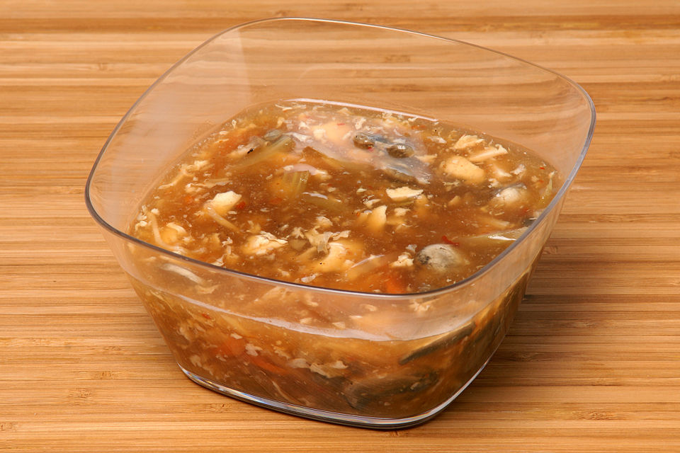

# 酸辣汤 | Hot & Sour Soup

  

> 冬天的夜晚，一碗酸辣汤下肚，从胃暖到心。酸辣汤在美国中餐馆是点单率最高的汤品之一，其实自己做更简单更好喝——一口锅、十五分钟，酸辣鲜香，比外卖强十倍。
>
> *On a cold night, a bowl of hot & sour soup warms you from the inside out. It's one of the most ordered soups at Chinese restaurants in America — but making it yourself is easier and tastier. One pot, fifteen minutes, and the result blows takeout out of the water.*

---

## 食材 | Ingredients

| 食材 | Ingredient | 用量 / Amount |
|------|-----------|---------------|
| 豆腐 | Firm tofu | 半块 / half block (~200g) |
| 鸡蛋 | Egg | 1个 / 1 |
| 木耳 | Wood ear mushrooms (dried) | 5g (一小把 / a small handful) |
| 胡萝卜 | Carrot | 半根 / half |
| 香菇 | Shiitake mushrooms | 3朵 / 3 pieces |
| 鸡汤 | Chicken broth | 800ml |
| 香醋 | Chinkiang vinegar | 3汤匙 / 3 tbsp |
| 酱油 | Soy sauce | 1汤匙 / 1 tbsp |
| 白胡椒粉 | Ground white pepper | 1茶匙 / 1 tsp |
| 辣椒油 | Chili oil | 1汤匙 / 1 tbsp (可调 / adjustable) |
| 淀粉 | Cornstarch | 2汤匙 / 2 tbsp |
| 香油 | Sesame oil | 少许 / a drizzle |
| 盐 | Salt | 适量 / to taste |
| 葱花 | Chopped scallion | 适量 / for garnish |

---

## 做法 | Directions

### 1. 泡发切丝 | Soak & Slice
干木耳泡发15分钟（或用热水5分钟加速）。豆腐、胡萝卜、香菇全部切细丝。

Soak dried wood ear mushrooms for 15 minutes (or 5 min in hot water). Julienne the tofu, carrot, and shiitake mushrooms.

### 2. 煮汤 | Build the Soup
锅中倒入鸡汤烧开，放入木耳丝、胡萝卜丝、香菇丝，煮3分钟。加入豆腐丝，再煮2分钟。

Bring chicken broth to a boil. Add wood ear, carrot, and shiitake shreds. Simmer 3 minutes. Add tofu shreds and cook 2 more minutes.

### 3. 调味 | Season
加入酱油、香醋、白胡椒粉和盐，搅匀。

Stir in soy sauce, Chinkiang vinegar, white pepper, and salt. Mix well.

### 4. 勾芡打蛋花 | Thicken & Add Egg
淀粉加3汤匙冷水调成水淀粉，缓缓倒入汤中搅匀至浓稠。鸡蛋打散，沿锅边淋入，轻轻搅动形成蛋花。

Mix cornstarch with 3 tbsp cold water. Slowly pour into the soup while stirring until thickened. Beat the egg, drizzle along the edge of the pot, and stir gently to form ribbons.

### 5. 出锅 | Serve
淋入辣椒油和香油，撒葱花，即可出锅。

Drizzle with chili oil and sesame oil. Garnish with scallions and serve.

---

## 要点 | Tips

| 要点 | Tip |
|------|-----|
| 醋和胡椒是灵魂，要舍得放 | Vinegar and white pepper are the soul — be generous |
| 辣椒油按个人口味调整 | Adjust chili oil to your heat preference |
| 勾芡要一边倒一边搅，防止结块 | Pour the starch slurry slowly while stirring to avoid lumps |
| 蛋花要沿锅边淋，不要搅碎 | Drizzle egg along the pot's edge — don't break it up |
| 没有木耳可以不放，不影响核心风味 | Wood ear is optional — the soup is still great without it |

---

## 替代食材 | American Substitutions

| 原料 | Ingredient | 替代 / Substitute | 备注 / Notes |
|------|-----------|-------------------|--------------|
| 豆腐 | Firm tofu | Trader Joe's / Whole Foods / Walmart 都有 | 选 firm 或 extra firm / Choose firm or extra firm |
| 木耳 | Wood ear mushrooms | 亚洲超市/Amazon；可省略 | Optional — skip if unavailable |
| 鸡汤 | Chicken broth | Swanson、Pacific Foods 低钠鸡汤 | 任何超市 / Any supermarket |
| 香醋 | Chinkiang vinegar | 亚洲超市；替代：balsamic + rice vinegar | 建议买正宗的 / Worth buying the real thing |
| 辣椒油 | Chili oil | Lao Gan Ma (老干妈) 亚洲超市必有；或 Amazon | 也可用 Sriracha 替代 / Sriracha works too |
| 香菇 | Shiitake mushrooms | 任何超市 / Any supermarket | 新鲜或干的均可 / Fresh or dried |
