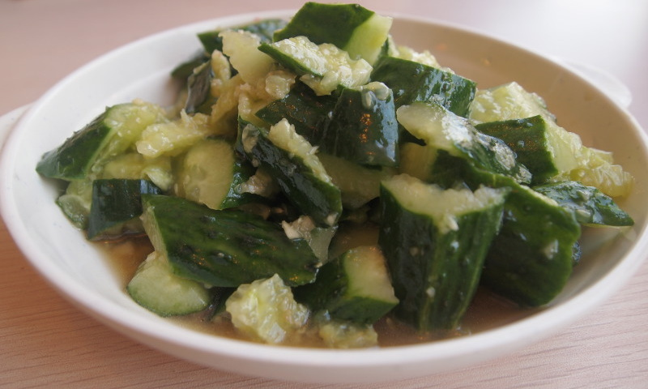

# 凉拌黄瓜 | Smashed Cucumber Salad

> ⏱ 5分钟 (无需烹饪) | 💰 ~$1.50/份 | 🏷️ 免开火、凉菜、全超市可买

  

> 不开火、不用锅、五分钟搞定的中国菜。黄瓜拍碎，拌上蒜和醋，就是夏天最爽的一道凉菜。在美国的夏天，当你热得不想做饭的时候，这道菜就是你的救星。
>
> *No stove, no pan, five minutes flat. Smash a cucumber, toss with garlic and vinegar, and you've got the most refreshing Chinese cold dish for summer. When it's too hot in America to even think about cooking, this salad is your savior.*

---

## 食材 | Ingredients

| 食材 | Ingredient | 用量 / Amount |
|------|-----------|---------------|
| 黄瓜 | Cucumber | 2根 / 2 |
| 蒜 | Garlic | 4瓣 / 4 cloves |
| 香醋 | Chinkiang vinegar | 2汤匙 / 2 tbsp |
| 酱油 | Soy sauce | 1汤匙 / 1 tbsp |
| 白糖 | Sugar | 1茶匙 / 1 tsp |
| 盐 | Salt | 1茶匙 / 1 tsp |
| 香油 | Sesame oil | 1汤匙 / 1 tbsp |
| 辣椒油 | Chili oil (optional) | 1汤匙 / 1 tbsp |

---

## 做法 | Directions

### 1. 拍黄瓜 | Smash the Cucumber
黄瓜洗净，用刀面或擀面杖拍碎（不要切！拍碎的表面不规则，更入味）。然后用手掰成小段。

Wash the cucumbers. Smash them with the flat side of a knife or a rolling pin (don't slice — the irregular surfaces absorb more flavor). Break into bite-sized pieces by hand.

### 2. 腌制 | Salt & Drain
拍碎的黄瓜加盐拌匀，静置5分钟，倒掉多余水分。

Toss the smashed cucumber with salt. Let sit 5 minutes, then drain off the excess liquid.

### 3. 调味 | Season
蒜切末（蒜要多）。加入香醋、酱油、白糖、香油和蒜末，拌匀。喜欢辣的加辣椒油。

Mince the garlic (be generous). Add vinegar, soy sauce, sugar, sesame oil, and garlic. Toss well. Add chili oil if you like heat.

### 4. 冷藏上桌 | Chill & Serve
拌好后可以直接吃，也可以冷藏15分钟更入味。

Serve immediately, or refrigerate 15 minutes for the flavors to deepen.

---

## 要点 | Tips

| 要点 | Tip |
|------|-----|
| 黄瓜要拍不要切，口感和入味完全不同 | Smash, don't slice — the texture and flavor absorption are totally different |
| 蒜要多，蒜香是灵魂 | Use lots of garlic — it's the soul of this dish |
| 拌好后尽快吃，放久了黄瓜会出水变软 | Eat soon after mixing — cucumbers get watery and soggy over time |
| 用 English cucumber 或 Persian cucumber 最好 | English or Persian cucumbers work best — less seeds, crunchier |
| 可以加花生碎、芝麻增加口感 | Add crushed peanuts or sesame seeds for extra crunch |

---

## 替代食材 | American Substitutions

| 原料 | Ingredient | 替代 / Substitute | 备注 / Notes |
|------|-----------|-------------------|--------------|
| 黄瓜 | Cucumber | English cucumber 或 Persian cucumber | 任何超市 / Any supermarket. 不推荐普通美国粗黄瓜 / Skip regular American cucumbers — too seedy |
| 蒜 | Garlic | 任何超市 / Any supermarket | Trader Joe's 有剥好的蒜 / TJ's sells pre-peeled garlic |
| 香醋 | Chinkiang vinegar | 亚洲超市；替代：rice vinegar | 正宗的更好 / The real thing is better |
| 辣椒油 | Chili oil | 老干妈 Lao Gan Ma (亚洲超市/Amazon) | 或 Trader Joe's chili crunch / Or TJ's chili crunch |
| 香油 | Sesame oil | 任何超市 / Any supermarket | — |
