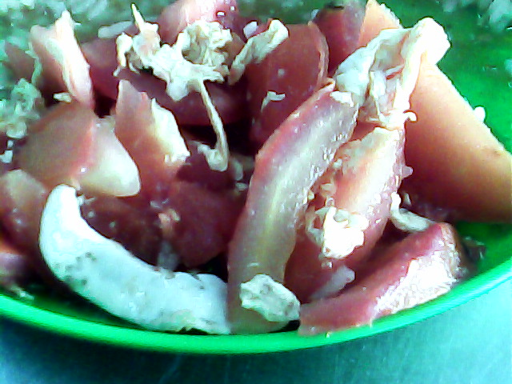

# 番茄炒蛋 | Tomato & Egg Stir-fry

> ⏱ 准备 5分钟 + 烹饪 5分钟 | 💰 ~$1.50/份 | 🏷️ 快手、新手第一道菜、全超市可买

  

> 如果中国菜只能留一道，那一定是番茄炒蛋。三种食材，十分钟，却是十四亿中国人共同的味觉记忆。酸甜的番茄裹着嫩滑的鸡蛋，配一碗白米饭，就是最简单最治愈的家的味道。
>
> *If China could keep only one dish, it would be this. Three ingredients, ten minutes, and yet it is the shared flavor memory of 1.4 billion people. Tangy tomatoes cradling soft, golden eggs over a bowl of steamed rice — the simplest, most healing taste of home.*

---

## 食材 | Ingredients

| 食材 | Ingredient | 用量 / Amount |
|------|-----------|---------------|
| 番茄 | Tomatoes | 2个 / 2 medium |
| 鸡蛋 | Eggs | 3个 / 3 |
| 葱 | Scallion | 1根 / 1 stalk |
| 白糖 | Sugar | 1汤匙 / 1 tbsp |
| 盐 | Salt | 适量 / to taste |
| 植物油 | Vegetable oil | 3汤匙 / 3 tbsp |

---

## 做法 | Directions

### 1. 备料 | Prep
番茄切块（不要太小），鸡蛋打散加一小撮盐，葱切葱花。

Cut tomatoes into wedges (not too small). Beat eggs with a tiny pinch of salt. Slice the scallion.

### 2. 炒蛋 | Scramble the Eggs
锅中多放油烧热，倒入蛋液，不要急着翻，等底部凝固后翻炒成大块，盛出。

Heat a generous amount of oil in a wok. Pour in the eggs — don't rush. Wait until the bottom sets, then fold into large, fluffy curds. Set aside.

### 3. 炒番茄 | Cook the Tomatoes
锅中留底油，放入番茄块，加糖和盐，翻炒至番茄出汁软烂。

In the remaining oil, add tomato wedges with sugar and salt. Stir-fry until tomatoes break down and release their juices.

### 4. 合炒出锅 | Combine & Serve
将鸡蛋倒回锅中，与番茄翻炒均匀，撒葱花，立即出锅。

Return the eggs to the wok. Toss with the tomatoes until well combined. Sprinkle with scallions and serve immediately.

---

## 要点 | Tips

| 要点 | Tip |
|------|-----|
| 油要多，蛋才嫩 | Use plenty of oil — that's the secret to fluffy eggs |
| 蛋不要炒太碎，大块更好吃 | Don't over-scramble — large, soft curds are best |
| 加糖是关键，提鲜去酸 | Sugar is essential — it balances the acidity |
| 番茄要炒出汁，不能生硬 | Cook tomatoes until they release juice — not crunchy |
| 配白米饭是标配 | Serve with steamed rice — the classic pairing |

---

## 替代食材 | American Substitutions

| 原料 | Ingredient | 替代 / Substitute | 备注 / Notes |
|------|-----------|-------------------|--------------|
| 番茄 | Tomatoes | 任何超市 / Any supermarket | Roma tomatoes 汁多最好 / Roma is juiciest |
| 鸡蛋 | Eggs | 任何超市 / Any supermarket | — |
| 葱 | Scallion | 任何超市 / Any supermarket | — |
