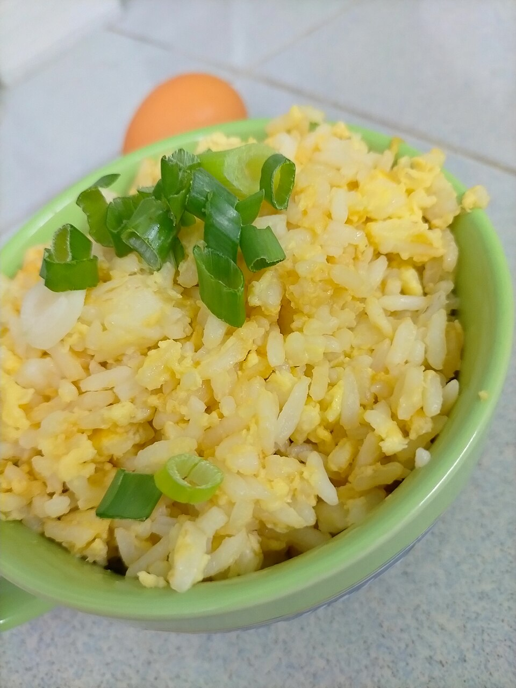

# 蛋炒饭 | Egg Fried Rice

> ⏱ 准备 5分钟 + 烹饪 5分钟 | 💰 ~$1/份 | 🏷️ 快手、零浪费(隔夜饭)、全超市可买

  

> 蛋炒饭是留学生的生存技能。冰箱里有什么就放什么，隔夜饭加个鸡蛋，五分钟就是一顿。看似简单，但"饭要粒粒分明、蛋要金黄包饭"的境界，值得你做一百次去追求。
>
> *Egg fried rice is the survival skill of every student abroad. Whatever's in the fridge goes in — day-old rice, an egg, five minutes, done. It looks simple, but the pursuit of "every grain separate, every grain kissed with golden egg" is a lifelong journey worth starting today.*

---

## 食材 | Ingredients

| 食材 | Ingredient | 用量 / Amount |
|------|-----------|---------------|
| 隔夜冷饭 | Day-old cold rice | 2碗 / 2 bowls (~300g) |
| 鸡蛋 | Eggs | 2-3个 / 2-3 |
| 葱 | Scallion | 2根 / 2 stalks |
| 盐 | Salt | 适量 / to taste |
| 酱油 | Soy sauce | 1汤匙 / 1 tbsp (optional) |
| 植物油 | Vegetable oil | 2汤匙 / 2 tbsp |

**可选加料 / Optional Add-ins:**

| 食材 | Ingredient | 用量 / Amount |
|------|-----------|---------------|
| 火腿肠/午餐肉 | Hot dog / Spam | 1根或几片 / 1 or a few slices |
| 冷冻青豆和玉米 | Frozen peas & corn | 一小把 / a handful |
| 虾仁 | Shrimp | 几只 / a few |

---

## 做法 | Directions

### 1. 备料 | Prep
隔夜饭用手搓散（或微波30秒打散）。鸡蛋打散。葱切花，分葱白和葱绿。

Break up the cold rice by hand (or microwave 30 seconds to loosen). Beat the eggs. Separate scallion whites from greens.

### 2. 炒蛋 | Scramble
锅中热油至冒烟，倒入蛋液，快速翻炒成碎蛋，半熟时盛出。

Heat oil in a wok until smoking. Pour in eggs, scramble quickly into small bits. Remove while still slightly soft.

### 3. 炒饭 | Fry the Rice
锅中再加少许油，放入葱白爆香。倒入冷饭，大火翻炒，用铲子压散结块，持续翻炒2-3分钟至饭粒干爽分明。

Add a splash more oil. Sear scallion whites until fragrant. Add the cold rice. Stir-fry over high heat, pressing to break any clumps. Keep tossing for 2–3 minutes until every grain is separate and dry.

### 4. 合炒调味 | Combine & Season
倒回鸡蛋，加入盐（和酱油如果喜欢），大火快速翻匀。撒葱绿，出锅。

Return the eggs. Season with salt (and soy sauce if desired). Toss over high heat until everything is evenly mixed. Sprinkle scallion greens and serve.

---

## 要点 | Tips

| 要点 | Tip |
|------|-----|
| 必须用隔夜冷饭！新鲜热饭会粘成一团 | Must use day-old cold rice — fresh rice turns to mush |
| 大火是灵魂，锅要够热 | High heat is everything — the wok must be screaming hot |
| 先炒蛋后炒饭，最后合并 | Eggs first, rice second, combine at the end |
| 不停翻炒，不要让饭贴锅 | Keep tossing — never let the rice sit on the bottom |
| 酱油要少放，多了饭会湿 | Go easy on soy sauce — too much makes the rice soggy |

---

## 替代食材 | American Substitutions

| 原料 | Ingredient | 替代 / Substitute | 备注 / Notes |
|------|-----------|-------------------|--------------|
| 米饭 | Rice | 任何大米；Instant Pot 煮最方便 | Costco Calrose rice 性价比高 / Costco Calrose is great value |
| 鸡蛋 | Eggs | 任何超市 / Any supermarket | — |
| 葱 | Scallion | 任何超市 / Any supermarket | — |
| 冷冻蔬菜 | Frozen peas & corn | Trader Joe's / Walmart 冷冻区 | 非常方便 / Super convenient |
| 午餐肉 | Spam | 任何超市罐头区 / Canned aisle | 经典加料 / Classic add-in |
