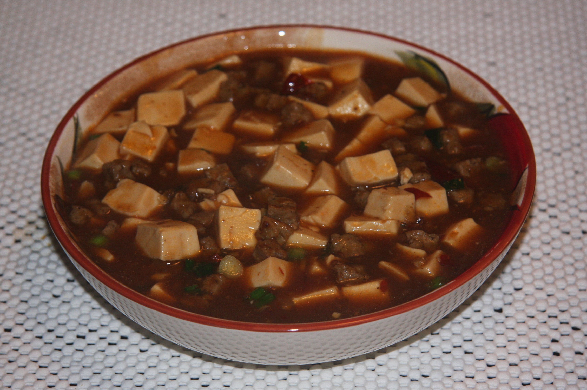

# 麻婆豆腐 | Mapo Tofu

  

> 川菜之魂，麻辣鲜香烫——五味俱全。在美国想吃辣的时候，没有什么比一盘麻婆豆腐配白饭更解馋的了。Walmart 有豆腐，亚洲超市有郫县豆瓣酱，二十分钟搞定一盘正宗川味。
>
> *The soul of Sichuan cuisine — numbing, spicy, savory, fragrant, and piping hot. When you're craving heat in America, nothing satisfies like a plate of Mapo Tofu over rice. Walmart carries tofu, Asian markets stock doubanjiang, and twenty minutes is all you need for authentic Sichuan flavor.*

---

## 食材 | Ingredients

| 食材 | Ingredient | 用量 / Amount |
|------|-----------|---------------|
| 嫩豆腐 | Soft or medium tofu | 1块 / 1 block (~400g) |
| 猪肉馅 | Ground pork | 100g |
| 郫县豆瓣酱 | Doubanjiang (Pixian chili bean paste) | 2汤匙 / 2 tbsp |
| 蒜 | Garlic | 3瓣 / 3 cloves |
| 姜 | Ginger | 1茶匙姜末 / 1 tsp minced |
| 葱 | Scallion | 2根 / 2 stalks |
| 花椒粉 | Sichuan peppercorn powder | 1茶匙 / 1 tsp |
| 酱油 | Soy sauce | 1汤匙 / 1 tbsp |
| 淀粉 | Cornstarch | 1汤匙 / 1 tbsp |
| 植物油 | Vegetable oil | 2汤匙 / 2 tbsp |
| 水 | Water | 200ml |

---

## 做法 | Directions

### 1. 备料 | Prep
豆腐切2cm小方块，放入加了少许盐的热水中泡5分钟（防碎）。蒜切末，葱切花。

Cut tofu into 2 cm cubes. Soak in hot salted water for 5 minutes (this firms them up). Mince garlic, slice scallions.

### 2. 炒肉末 | Cook the Pork
锅中热油，放入猪肉馅炒散至变色出油。

Heat oil in a wok. Add ground pork and stir-fry until browned and the fat renders.

### 3. 炒酱 | Fry the Paste
加入郫县豆瓣酱，小火炒出红油。加入蒜末和姜末炒香。

Add doubanjiang and stir-fry on low heat until the oil turns red. Add garlic and ginger, stir until fragrant.

### 4. 煮豆腐 | Simmer the Tofu
加入200ml水和酱油，烧开。轻轻放入豆腐块，小火煮5分钟让豆腐入味。

Add 200 ml water and soy sauce. Bring to a boil. Gently slide in the tofu cubes. Simmer on low heat for 5 minutes to let the tofu absorb the flavor.

### 5. 勾芡出锅 | Thicken & Serve
淀粉加2汤匙水调匀，倒入锅中轻轻推匀。撒花椒粉和葱花，出锅。

Mix cornstarch with 2 tbsp water. Pour into the wok and gently push (don't stir hard — tofu breaks easily). Sprinkle with Sichuan peppercorn powder and scallions. Serve.

---

## 要点 | Tips

| 要点 | Tip |
|------|-----|
| 豆腐先泡热盐水，不容易碎 | Soaking tofu in hot salted water prevents it from crumbling |
| 郫县豆瓣酱要小火炒出红油 | Fry doubanjiang on LOW heat to release red oil — don't burn it |
| 花椒粉最后撒，麻味最浓 | Sprinkle Sichuan pepper at the end for maximum numbing effect |
| 推豆腐不要用铲子搅，轻轻推 | Push the tofu gently — never stir aggressively |
| 不吃辣可以减少豆瓣酱用量 | Reduce doubanjiang if you can't handle the heat |

---

## 替代食材 | American Substitutions

| 原料 | Ingredient | 替代 / Substitute | 备注 / Notes |
|------|-----------|-------------------|--------------|
| 嫩豆腐 | Soft tofu | Trader Joe's / Walmart / Whole Foods 都有 | 选 soft 或 medium firm / Choose soft or medium firm |
| 郫县豆瓣酱 | Doubanjiang | 亚洲超市必有 (Lee Kum Kee 品牌)；Amazon 也有 | ⚠️ 核心调料，无真正替代品 / Essential — no real substitute |
| 花椒粉 | Sichuan peppercorn | 亚洲超市/Amazon | 普通黑胡椒完全不同 / Regular black pepper is NOT the same |
| 猪肉馅 | Ground pork | 任何超市 / Any supermarket | 也可用牛肉馅 / Ground beef works too |
