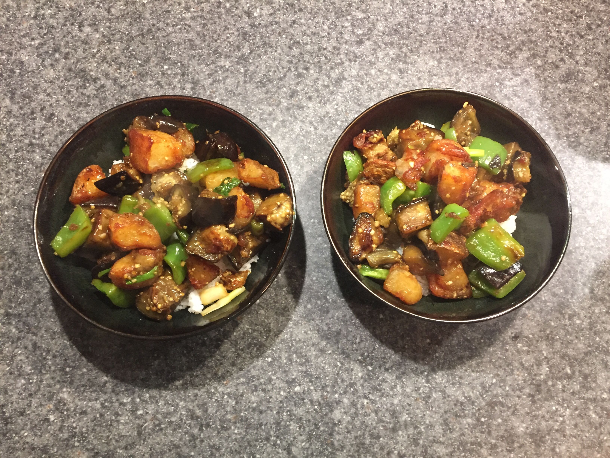

# 地三鲜 | Di San Xian (Stir-fried Potato, Eggplant & Pepper)

> ⏱ 准备 15分钟 + 烹饪 10分钟 | 💰 ~$4/份 | 🏷️ 素食、东北菜、全超市可买

  

> 东北名菜，"地三鲜"指的是大地赐予的三样鲜味：土豆、茄子、青椒。三种最普通的食材，经过油炸和爆炒，变成一道让人停不下筷子的下饭菜。在美国超市这三样食材随便买，$4 以内搞定。
>
> *A Northeastern Chinese classic — "Three Treasures of the Earth" refers to potato, eggplant, and green pepper. Three of the most humble ingredients, flash-fried and tossed in a savory sauce, become an irresistible rice companion. All three are available at any American supermarket for under $4.*

---

## 食材 | Ingredients

| 食材 | Ingredient | 用量 / Amount |
|------|-----------|---------------|
| 土豆 | Potato | 1个大 / 1 large |
| 茄子 | Chinese eggplant (or regular) | 1根 / 1 |
| 青椒 | Green bell pepper | 1个 / 1 |
| 蒜 | Garlic | 4瓣 / 4 cloves |
| 酱油 | Soy sauce | 2汤匙 / 2 tbsp |
| 白糖 | Sugar | 1茶匙 / 1 tsp |
| 淀粉 | Cornstarch | 1汤匙 / 1 tbsp |
| 盐 | Salt | 适量 / to taste |
| 植物油 | Vegetable oil | 适量 / as needed (for frying) |

---

## 做法 | Directions

### 1. 切料 | Prep
土豆切滚刀块，茄子切滚刀块，青椒切块。蒜切末。

Cut potato into rough chunks. Cut eggplant into similar chunks. Cut pepper into pieces. Mince garlic.

### 2. 炸 | Fry
锅中多放油，烧至七成热。先炸土豆至金黄捞出，再炸茄子至软捞出，最后过油青椒10秒捞出。

Heat generous oil. Fry potato chunks until golden, remove. Fry eggplant until soft, remove. Flash-fry pepper for 10 seconds, remove.

### 3. 调酱 | Make Sauce
碗中混合酱油、糖、淀粉和3汤匙水。

Mix soy sauce, sugar, cornstarch, and 3 tbsp water in a bowl.

### 4. 合炒 | Combine
锅中留底油，爆香蒜末，倒入所有炸好的蔬菜，淋入酱汁，大火翻炒至酱汁裹住食材。

Leave a little oil in the wok. Sear garlic until fragrant. Add all fried vegetables. Pour in the sauce. Toss over high heat until the sauce coats everything.

---

## 要点 | Tips

| 要点 | Tip |
|------|-----|
| 土豆和茄子要分开炸，火候不同 | Fry potato and eggplant separately — they cook at different rates |
| 茄子吸油，不要怕油多 | Eggplant absorbs oil — don't be shy with the oil |
| 不想油炸可以用空气炸锅 | Skip deep-frying with an air fryer — works great |
| 青椒最后放，保持脆感 | Add pepper last to keep it crunchy |

---

## 替代食材 | American Substitutions

| 原料 | Ingredient | 替代 / Substitute | 备注 / Notes |
|------|-----------|-------------------|--------------|
| 茄子 | Eggplant | 美国普通茄子 (globe eggplant) 切小块 | 中式长茄子在亚洲超市有 / Chinese eggplant at Asian markets |
| 土豆 | Potato | Yukon Gold 最好 | 任何超市 / Any supermarket |
| 青椒 | Green pepper | 任何超市 / Any supermarket | — |
