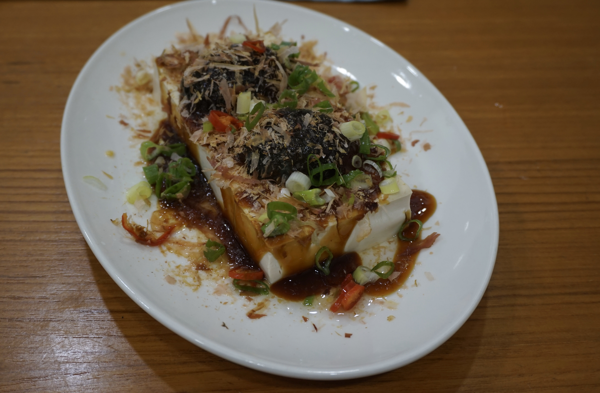

# 皮蛋豆腐 | Century Egg Tofu

> ⏱ 5分钟 (无需烹饪) | 💰 ~$3/份 | 🏷️ 素食、免开火、凉菜、需要亚洲超市

  

> 零烹饪的中国凉菜——豆腐切块，皮蛋切碎，淋上酱油和香油就完成了。夏天不想开火的时候，这就是你的晚餐。皮蛋在亚洲超市或 Amazon 都能买到。
>
> *A zero-cooking Chinese cold dish — cube tofu, chop century eggs, drizzle soy sauce and sesame oil. On hot summer nights when you can't face the stove, this IS dinner. Century eggs are available at Asian markets or Amazon.*

---

## 食材 | Ingredients

| 食材 | Ingredient | 用量 / Amount |
|------|-----------|---------------|
| 嫩豆腐 | Silken tofu | 1块 / 1 block |
| 皮蛋 | Century eggs | 2个 / 2 |
| 酱油 | Soy sauce | 2汤匙 / 2 tbsp |
| 香油 | Sesame oil | 1汤匙 / 1 tbsp |
| 葱花 | Chopped scallion | 1汤匙 / 1 tbsp |
| 辣椒油 (可选) | Chili oil (optional) | 适量 / to taste |

---

## 做法 | Directions

### 1. 切 | Cut
豆腐切成小方块摆盘。皮蛋剥壳，切成小块，铺在豆腐上。

Cut tofu into small cubes and arrange on a plate. Peel century eggs, cut into small pieces, and scatter over the tofu.

### 2. 调味 | Season
淋上酱油和香油，撒葱花。喜欢辣的加辣椒油。

Drizzle with soy sauce and sesame oil. Sprinkle with scallions. Add chili oil if desired.

### 3. 吃 | Eat
直接吃。就这么简单。

Eat. That's it. Really.

---

## 要点 | Tips

| 要点 | Tip |
|------|-----|
| 用嫩豆腐（silken），不要用老豆腐 | Use silken tofu — firm tofu won't have the right texture |
| 皮蛋冷藏后更好切 | Century eggs are easier to cut when chilled |
| 可以加老干妈辣酱，味道升级 | Add Lao Gan Ma chili crisp for a major flavor upgrade |

---

## 替代食材 | American Substitutions

| 原料 | Ingredient | 替代 / Substitute | 备注 / Notes |
|------|-----------|-------------------|--------------|
| 皮蛋 | Century eggs | 亚洲超市/Amazon | 无替代品，但不贵 (~$3/4个) / No substitute, but cheap |
| 嫩豆腐 | Silken tofu | Trader Joe's / Walmart / Whole Foods | 选 silken 或 soft |
