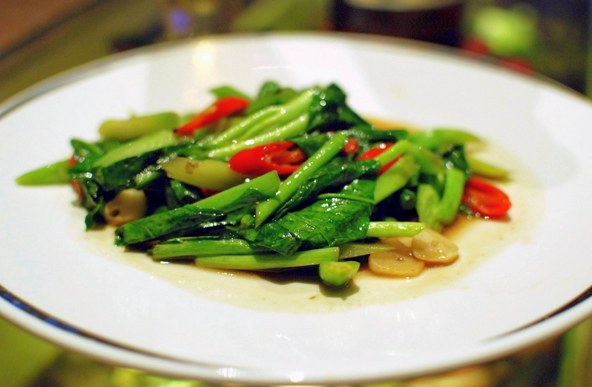

# 蒜蓉西兰花 | Garlic Broccoli Stir-fry

> ⏱ 准备 5分钟 + 烹饪 5分钟 | 💰 ~$2.50/份 | 🏷️ 素食、快手、全超市可买、健康

  

> 最简单的中式蔬菜——西兰花焯水，蒜末爆香，大火翻炒30秒。健身党最爱，蛋白质不够的时候加点虾仁或鸡胸肉。Trader Joe's 的冷冻西兰花更方便。
>
> *The simplest Chinese vegetable dish — blanch broccoli, sizzle garlic in oil, toss for 30 seconds. A gym-goer's favorite. Add shrimp or chicken breast if you need more protein. Trader Joe's frozen broccoli makes it even easier.*

---

## 食材 | Ingredients

| 食材 | Ingredient | 用量 / Amount |
|------|-----------|---------------|
| 西兰花 | Broccoli | 1大头 / 1 large head (~300g) |
| 蒜 | Garlic | 5瓣 / 5 cloves |
| 盐 | Salt | 适量 / to taste |
| 植物油 | Vegetable oil | 2汤匙 / 2 tbsp |
| 蚝油 (可选) | Oyster sauce (optional) | 1汤匙 / 1 tbsp |

---

## 做法 | Directions

### 1. 焯水 | Blanch
西兰花切小朵，烧一锅水加少许盐和几滴油，焯水1分钟至翠绿，捞出沥干。

Cut broccoli into florets. Boil water with a pinch of salt and a few drops of oil. Blanch 1 minute until bright green. Drain.

### 2. 炒蒜 | Sizzle Garlic
锅中热油，放入蒜末爆香至金黄（10秒，别烧黑）。

Heat oil in a wok. Add minced garlic and sizzle for 10 seconds until golden (don't burn).

### 3. 翻炒 | Toss
放入西兰花，加盐和蚝油，大火翻炒30秒即可。

Add broccoli, salt, and oyster sauce. Toss over high heat for 30 seconds. Done.

---

## 要点 | Tips

| 要点 | Tip |
|------|-----|
| 焯水不要超过1分钟，保持脆感和颜色 | Don't blanch more than 1 min — keep it crunchy and green |
| 蒜末要多，蒜香是关键 | Use lots of garlic — it's the star |
| 可以用冷冻西兰花省时间 | Frozen broccoli saves time — just thaw and stir-fry |

---

## 替代食材 | American Substitutions

| 原料 | Ingredient | 替代 / Substitute | 备注 / Notes |
|------|-----------|-------------------|--------------|
| 西兰花 | Broccoli | 任何超市 / Any supermarket | TJ's 冷冻西兰花最方便 |
| 蚝油 | Oyster sauce | Lee Kum Kee at Walmart/Target | 可省略 / Optional |
